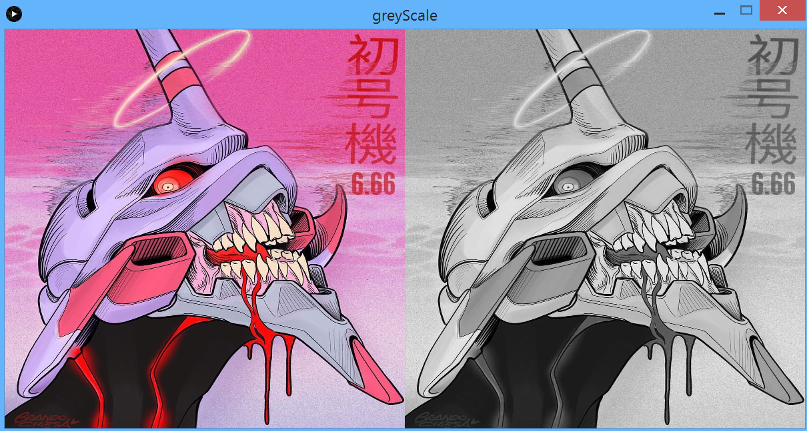

## Promedio rgb en imágenes
Link al [código fuente](https://github.com/VisualUN/Processing/tree/master/greyScale)
```
PImage img;

void setup() {
  size(1200, 600);
  img = loadImage("imagen.jpg");
  image(img, width/2, 0, width/2, height);


  for (int x=width/2; x<width; x++)
  {
    for (int y=0; y<height; y++)
    {
      color c = get(x, y);
      float red = red(c);
      float green = green(c);
      float blue = blue(c);
      int average = (int)(red+green+blue)/3;
      color Color = color(average, average, average);
      set(x, y, Color);
    }
  }

  image(img, 0, 0, width/2, height);
}

void draw() {
}
```
### Resultado:


## Promedio rgb en videos
Link al [código fuente](https://github.com/VisualUN/Processing/tree/master/greyScaleVideo)
```
PImage img;
import processing.video.*;
Movie myMovie;

void setup() {
  size(1200, 600);
  background(0);
  myMovie = new Movie(this, "video.mp4");
  myMovie.loop();
  myMovie.volume(0);

}

void movieEvent(Movie m) {
  m.read();
}

void draw() {
  image(myMovie, 0, 0, width, height);
  for (int x=width/2; x<width; x++)
  {
    for (int y=0; y<height; y++)
    {
      color c = get(x, y);
      float red = red(c);
      float green = green(c);
      float blue = blue(c);
      int average = (int)(red+green+blue)/3;
      color Color = color(average, average, average);
      set(x, y, Color);
    }
  }

}
```

## Luma en imágenes
Link al [código fuente](https://github.com/VisualUN/Processing/tree/master/luma)

```
PImage img;
void setup() {
  size(1200, 600);
  img = loadImage("imagen.jpg");
  image(img, width/2, 0, width/2, height);

  for (int x=width/2; x<width; x++)
  {
    for (int y=0; y<height; y++)
    {
      color c = get(x, y);
      float red = red(c);
      float green = green(c);
      float blue = blue(c);
      float grey = red*0.299 + green*0.587 + blue*0.114;
      color Color = color(grey, grey, grey);
      set(x, y, Color);
    }
  }
  image(img, 0, 0, width/2, height);
}

void draw() {
}
```
### Resultado


## Luma en videos
Link al [código fuente](https://github.com/VisualUN/Processing/tree/master/lumaVideo)

```
PImage img;
import processing.video.*;
Movie myMovie;


void setup() {
  size(1200, 600);
  background(0);
  myMovie = new Movie(this, "video.mp4");
  myMovie.loop();
  myMovie.volume(0);

}

void movieEvent(Movie m) {
  m.read();
}

void draw() {
  //las 2 al tiempo
  image(myMovie, width/2, 0, width/2, height);
  image(myMovie, 0, 0, width/2, height);
  for (int x=width/2; x<width; x++)
  {
    for (int y=0; y<height; y++)
    {
      color c = get(x, y);
      float red = red(c);
      float green = green(c);
      float blue = blue(c);
      float grey = red*0.299 + green*0.587 + blue*0.114;
      color Color = color(grey, grey, grey);
      set(x, y, Color);
    }
  }
}
```

## Desaturación
Link al [código fuente](https://github.com/VisualUN/Processing/tree/master/desaturation)
```
PImage img;
void setup() {
  size(1200, 600);
  img = loadImage("imagen.jpg");
  image(img, width/2, 0, width/2, height);

  for (int x=width/2; x<width; x++)
  {
    for (int y=0; y<height; y++)
    {
      color c = get(x, y);
      float red = red(c);
      float green = green(c);
      float blue = blue(c);
      float grey = (max(red,green,blue)+min(red,green,blue) /2);
      color Color = color(grey, grey, grey);
      set(x, y, Color);
    }
  }
  image(img, 0, 0, width/2, height);
}

void draw() {
}
```
### Resultado


## Extracción de sombras (Shades)
Link al [código fuente](https://github.com/VisualUN/Processing/tree/master/desaturation)
```
PImage img;
void setup() {
  size(1200, 600);
  img = loadImage("imagen.jpg");
  image(img, width/2, 0, width/2, height);

  for (int x=width/2; x<width; x++)
  {
    for (int y=0; y<height; y++)
    {
      color c = get(x, y);
      float red = red(c);
      float green = green(c);
      float blue = blue(c);
      int shadesNumber = 3; //NumberOfShades is a value between 2 and 256
      float conversionFactor = 255 / (shadesNumber -1);
      float average = (red+green+blue) /3;
      float grey = int(average/conversionFactor) * conversionFactor;
      color Color = color(grey, grey, grey);
      set(x, y, Color);
    }
  }
  //original image
  image(img, 0, 0, width/2, height);
}

void draw() {
}
```
### Resultado con 3 capas


### Resultado con 5 capas


### Resultado con 8 capas

