## Mascara para afilar en imagenes
Link al [código fuente](https://github.com/VisualUN/Processing/tree/master/Convolucion/Convolucion_afilar)

```
PImage img;
int w = 120;

// It's possible to convolve the image with many different 
// matrices to produce different effects. This is a high-pass 
// filter; it accentuates the edges. 
float[][] matrix = { { 0, -1, 0},
                     { -1, 5, -1},
                     { 0, -1, 0}}; 

void setup() {
  size(1200, 600);
  img = loadImage("imagen3.jpg"); 
 // image(img, 0, 0);
  img.resize(600, 600);
  image(img, width/2, 0, width, height);
  
  int matrixsize = 3;
  
  for (int x = width/2; x < width; x++) {
    for (int y = 0; y < height; y++ ) {
      color c = convolution(x, y, matrix, matrixsize, img);
      set(x, y, c);
    }
  }
  image(img, 0, 0, width/2, height);
}

void draw() {
}

color convolution(int x, int y, float[][] matrix, int matrixsize, PImage img)
{
  float rtotal = 0.0;
  float gtotal = 0.0;
  float btotal = 0.0;
  int offset = matrixsize / 2;
  for (int i = 0; i < matrixsize; i++){
    for (int j= 0; j < matrixsize; j++){
      // What pixel are we testing
      int xloc = x+i-offset;
      int yloc = y+j-offset;
      int loc = xloc + img.width*yloc;
      // Make sure we haven't walked off our image, we could do better here
      loc = constrain(loc,0,img.pixels.length-1);
      // Calculate the convolution
      rtotal += (red(img.pixels[loc]) * matrix[i][j]);
      gtotal += (green(img.pixels[loc]) * matrix[i][j]);
      btotal += (blue(img.pixels[loc]) * matrix[i][j]);
    }
  }
  // Make sure RGB is within range
  rtotal = constrain(rtotal, 0, 255);
  gtotal = constrain(gtotal, 0, 255);
  btotal = constrain(btotal, 0, 255);
  // Return the resulting color
  return color(rtotal, gtotal, btotal);
}
```
### Resultado:
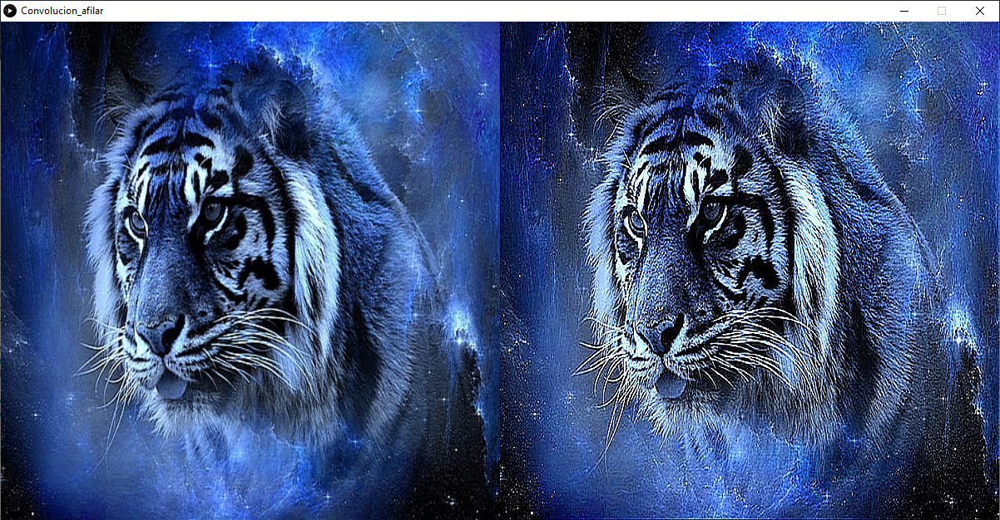

## Mascara para afilar en video
Link al [código fuente](https://github.com/VisualUN/Processing/tree/master/Convolucion/Convolucion_afilar_video)

```
PImage img;
import processing.video.*;
Movie myMovie;  

// It's possible to convolve the image with many different 
// matrices to produce different effects. This is a high-pass 
// filter; it accentuates the edges. 
float[][] matrix = { { 0, -1, 0},
                     { -1, 5, -1},
                     { 0, -1, 0}};

int matrixsize = 3;
void setup() {
  size(1200, 600);
  
  background(0);
  myMovie = new Movie(this, "video.mp4");
  myMovie.loop();
  myMovie.volume(0);  
}

void draw() {  
  if (myMovie.available()) {
    myMovie.read();
  }
  
  image(myMovie, 0, 0, width/2, height);
  
  for (int x = width/2; x < width; x++) {
    for (int y = 0; y < height; y++ ) {
      float rtotal = 0.0;
      float gtotal = 0.0;
      float btotal = 0.0;
      int offset = matrixsize / 2;
      for (int i=0; i < matrixsize; i++){
        for (int j=0; j < matrixsize; j++){
          int xloc = x+i-offset;
          int yloc = y+j-offset;
          int loc = xloc + (myMovie.width)*yloc;
          
          loc = constrain(loc,0,myMovie.pixels.length-1);
          // Calculate the convolution
          if(loc > 0){
            rtotal += (red(myMovie.pixels[loc]) * matrix[i][j]);
            gtotal += (green(myMovie.pixels[loc]) * matrix[i][j]);
            btotal += (blue(myMovie.pixels[loc]) * matrix[i][j]); 
          }
        }
      } 
      rtotal = constrain(rtotal, 0, 255);
      gtotal = constrain(gtotal, 0, 255);
      btotal = constrain(btotal, 0, 255);
      
      color Color = color(rtotal, gtotal, btotal);
      set(x, y, Color);
    }
  }  
}
```

## Mascara para desenfocar en imagenes
Link al [código fuente](https://github.com/VisualUN/Processing/tree/master/Convolucion/Convolucion_desenfoque)

```
PImage img;
int w = 120;

// It's possible to convolve the image with many different 
// matrices to produce different effects. This is a high-pass 
// filter; it accentuates the edges. 
float[][] matrix = { { 1, 1, 1},
                     { 1, 1, 1},
                     { 1, 1, 1}}; 

void setup() {
  size(1200, 600);
  img = loadImage("imagen3.jpg"); 
  img.resize(600, 600);
  image(img, width/2, 0, width, height);
  
  int matrixsize = 3;
  
  for (int x = width/2; x < width; x++) {
    for (int y = 0; y < height; y++ ) {
      color c = convolution(x, y, matrix, matrixsize, img);
      set(x, y, c);
    }
  }
  image(img, 0, 0, width/2, height);
}

void draw() {
}

color convolution(int x, int y, float[][] matrix, int matrixsize, PImage img)
{
  float rtotal = 0.0;
  float gtotal = 0.0;
  float btotal = 0.0;
  int offset = matrixsize / 2;
  for (int i = 0; i < matrixsize; i++){
    for (int j= 0; j < matrixsize; j++){
      // What pixel are we testing
      int xloc = x+i-offset;
      int yloc = y+j-offset;
      int loc = xloc + img.width*yloc;
      // Make sure we haven't walked off our image, we could do better here
      loc = constrain(loc,0,img.pixels.length-1);
      // Calculate the convolution
      rtotal += (red(img.pixels[loc]) * 1/9 * matrix[i][j]);
      gtotal += (green(img.pixels[loc]) * 1/9 * matrix[i][j]);
      btotal += (blue(img.pixels[loc]) * 1/9 * matrix[i][j]);
    }
  }
  // Make sure RGB is within range
  rtotal = constrain(rtotal, 0, 255);
  gtotal = constrain(gtotal, 0, 255);
  btotal = constrain(btotal, 0, 255);
  // Return the resulting color
  return color(rtotal, gtotal, btotal);
}
}
```
### Resultado:
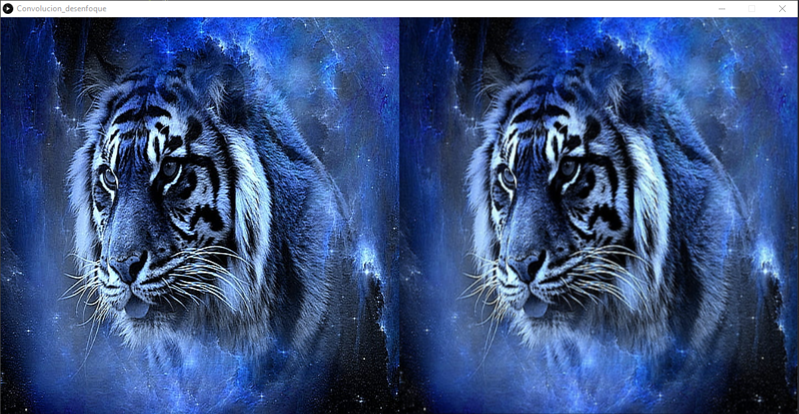

## Mascara para desenfocar en video
Link al [código fuente](https://github.com/VisualUN/Processing/tree/master/Convolucion/Convolucion_desenfoque_video)

```
PImage img;
import processing.video.*;
Movie myMovie;  

// It's possible to convolve the image with many different 
// matrices to produce different effects. This is a high-pass 
// filter; it accentuates the edges. 
float[][] matrix = { { 1, 1, 1},
                     { 1, 1, 1},
                     { 1, 1, 1}}; 

int matrixsize = 3;
void setup() {
  size(1200, 600);
  
  background(0);
  myMovie = new Movie(this, "video.mp4");
  myMovie.loop();
  myMovie.volume(0);  
}

void draw() {  
  if (myMovie.available()) {
    myMovie.read();
  }
  
  image(myMovie, 0, 0, width/2, height);
  
  for (int x = width/2; x < width; x++) {
    for (int y = 0; y < height; y++ ) {
      float rtotal = 0.0;
      float gtotal = 0.0;
      float btotal = 0.0;
      int offset = matrixsize / 2;
      for (int i=0; i < matrixsize; i++){
        for (int j=0; j < matrixsize; j++){
          int xloc = x+i-offset;
          int yloc = y+j-offset;
          int loc = xloc + (myMovie.width)*yloc;
          
          loc = constrain(loc,0,myMovie.pixels.length-1);
          // Calculate the convolution
          if(loc > 0){
            rtotal += (red(myMovie.pixels[loc]) * 1/9 * matrix[i][j]);
            gtotal += (green(myMovie.pixels[loc]) * 1/9  * matrix[i][j]);
            btotal += (blue(myMovie.pixels[loc]) * 1/9  * matrix[i][j]); 
          }
        }
      } 
      rtotal = constrain(rtotal, 0, 255);
      gtotal = constrain(gtotal, 0, 255);
      btotal = constrain(btotal, 0, 255);
      
      color Color = color(rtotal, gtotal, btotal);
      set(x, y, Color);
    }
  }  
}
```
## Mascara de desenfoque Gaussiano con matriz 3x3 en imagenes
Link al [código fuente](https://github.com/VisualUN/Processing/tree/master/Convolucion/Convolucion_desGauss3x3)

```
PImage img;
int w = 120;

// It's possible to convolve the image with many different 
// matrices to produce different effects. This is a high-pass 
// filter; it accentuates the edges. 
float[][] matrix = { { 1, 2, 1},
                     { 2, 4, 2},
                     { 1, 2, 1}}; 

void setup() {
  size(1200, 600);
  img = loadImage("imagen3.jpg"); 
 // image(img, 0, 0);
  img.resize(600, 600);
  image(img, width/2, 0, width, height);
  
  int matrixsize = 3;
  
  for (int x = width/2; x < width; x++) {
    for (int y = 0; y < height; y++ ) {
      color c = convolution(x, y, matrix, matrixsize, img);
      set(x, y, c);
    }
  }
  image(img, 0, 0, width/2, height);
}

void draw() {
}

color convolution(int x, int y, float[][] matrix, int matrixsize, PImage img)
{
  float rtotal = 0.0;
  float gtotal = 0.0;
  float btotal = 0.0;
  int offset = matrixsize / 2;
  for (int i = 0; i < matrixsize; i++){
    for (int j= 0; j < matrixsize; j++){
      // What pixel are we testing
      int xloc = x+i-offset;
      int yloc = y+j-offset;
      int loc = xloc + img.width*yloc;
      // Make sure we haven't walked off our image, we could do better here
      loc = constrain(loc,0,img.pixels.length-1);
      // Calculate the convolution
      rtotal += (red(img.pixels[loc]) * 1/16 * matrix[i][j]);
      gtotal += (green(img.pixels[loc]) * 1/16 * matrix[i][j]);
      btotal += (blue(img.pixels[loc]) * 1/16 * matrix[i][j]);
    }
  }
  // Make sure RGB is within range
  rtotal = constrain(rtotal, 0, 255);
  gtotal = constrain(gtotal, 0, 255);
  btotal = constrain(btotal, 0, 255);
  // Return the resulting color
  return color(rtotal, gtotal, btotal);
}
```
### Resultado:
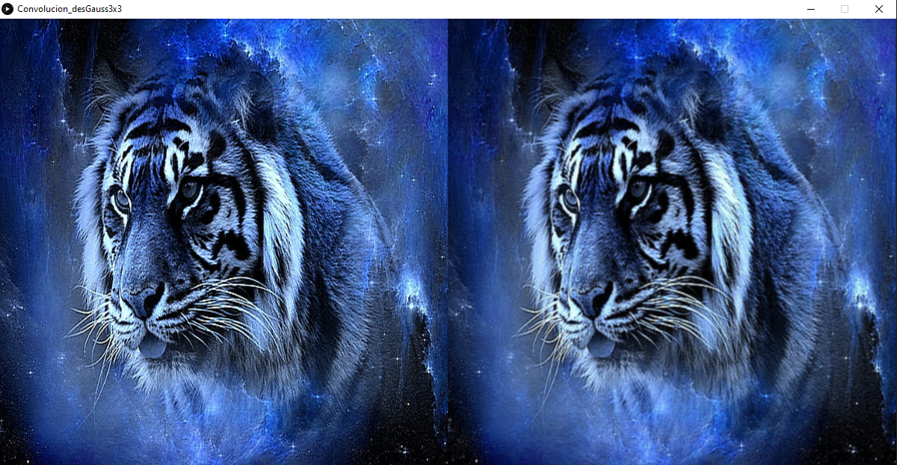

## Mascara de desenfoque Gaussiano con matriz 3x3 en video
Link al [código fuente](https://github.com/VisualUN/Processing/tree/master/Convolucion/Convolucion_desGauss3x3_video)

```
PImage img;
import processing.video.*;
Movie myMovie;  

// It's possible to convolve the image with many different 
// matrices to produce different effects. This is a high-pass 
// filter; it accentuates the edges. 
float[][] matrix = { { 1, 2, 1},
                     { 2, 4, 2},
                     { 1, 2, 1}}; 

int matrixsize = 3;
void setup() {
  size(1200, 600);  
  background(0);
  myMovie = new Movie(this, "video.mp4");
  myMovie.loop();
  myMovie.volume(0);  
}

void draw() {  
  if (myMovie.available()) {
    myMovie.read();
  }
  
  image(myMovie, 0, 0, width/2, height);
  
  for (int x = width/2; x < width; x++) {
    for (int y = 0; y < height; y++ ) {
      float rtotal = 0.0;
      float gtotal = 0.0;
      float btotal = 0.0;
      int offset = matrixsize / 2;
      for (int i=0; i < matrixsize; i++){
        for (int j=0; j < matrixsize; j++){
          int xloc = x+i-offset;
          int yloc = y+j-offset;
          int loc = xloc + (myMovie.width)*yloc;
          
          loc = constrain(loc,0,myMovie.pixels.length-1);
          // Calculate the convolution
          if(loc > 0){
            rtotal += (red(myMovie.pixels[loc]) * 1/16 * matrix[i][j]);
            gtotal += (green(myMovie.pixels[loc]) * 1/16 * matrix[i][j]);
            btotal += (blue(myMovie.pixels[loc]) * 1/16 * matrix[i][j]); 
          }
        }
      } 
      rtotal = constrain(rtotal, 0, 255);
      gtotal = constrain(gtotal, 0, 255);
      btotal = constrain(btotal, 0, 255);
      
      color Color = color(rtotal, gtotal, btotal);
      set(x, y, Color);
    }
  }  
}
```
## Mascara de desenfoque Gaussiano con matriz 5x5 en imagenes
Link al [código fuente](https://github.com/VisualUN/Processing/tree/master/Convolucion/Convolucion_desGauss5x5)

```
PImage img;
int w = 120;

// It's possible to convolve the image with many different 
// matrices to produce different effects. This is a high-pass 
// filter; it accentuates the edges. 
float[][] matrix = { { 1, 4, 6, 4, 1},
                     { 4, 16, 24, 16, 4},
                     { 6, 24, 36, 24, 6},
                     { 4, 16, 24, 16, 4},
                     { 1, 4, 6, 4, 1}}; 

void setup() {
  size(1200, 600);
  img = loadImage("imagen3.jpg");
  img.resize(600, 600);
  image(img, width/2, 0, width, height);
  
  int matrixsize = 5;
  
  for (int x = width/2; x < width; x++) {
    for (int y = 0; y < height; y++ ) {
      color c = convolution(x, y, matrix, matrixsize, img);
      set(x, y, c);
    }
  }
  image(img, 0, 0, width/2, height);
}

void draw() {
}

color convolution(int x, int y, float[][] matrix, int matrixsize, PImage img)
{
  float rtotal = 0.0;
  float gtotal = 0.0;
  float btotal = 0.0;
  int offset = matrixsize / 2;
  for (int i = 0; i < matrixsize; i++){
    for (int j= 0; j < matrixsize; j++){
      // What pixel are we testing
      int xloc = x+i-offset;
      int yloc = y+j-offset;
      int loc = xloc + img.width*yloc;
      // Make sure we haven't walked off our image, we could do better here
      loc = constrain(loc,0,img.pixels.length-1);
      // Calculate the convolution
      rtotal += (red(img.pixels[loc]) * 1/256 * matrix[i][j]);
      gtotal += (green(img.pixels[loc]) * 1/256 * matrix[i][j]);
      btotal += (blue(img.pixels[loc]) * 1/256 * matrix[i][j]);
    }
  }
  // Make sure RGB is within range
  rtotal = constrain(rtotal, 0, 255);
  gtotal = constrain(gtotal, 0, 255);
  btotal = constrain(btotal, 0, 255);
  // Return the resulting color
  return color(rtotal, gtotal, btotal);
}
```
### Resultado:
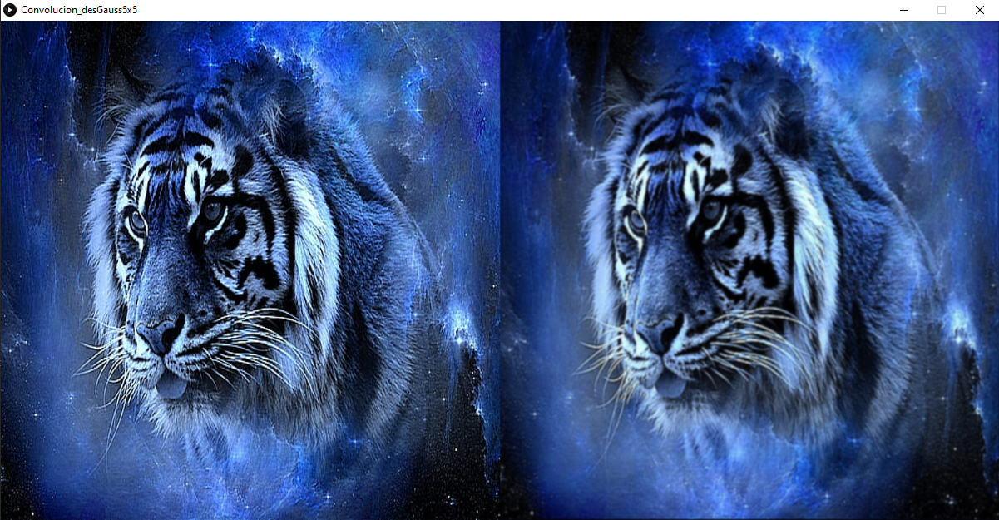

## Mascara de desenfoque Gaussiano con matriz 5x5 en video
Link al [código fuente](https://github.com/VisualUN/Processing/tree/master/Convolucion/Convolucion_desGauss5x5_video)

```
PImage img;
import processing.video.*;
Movie myMovie;  

// It's possible to convolve the image with many different 
// matrices to produce different effects. This is a high-pass 
// filter; it accentuates the edges. 
float[][] matrix = { { 1, 4, 6, 4, 1},
                     { 4, 16, 24, 16, 4},
                     { 6, 24, 36, 24, 6},
                     { 4, 16, 24, 16, 4},
                     { 1, 4, 6, 4, 1}};

int matrixsize = 5;
void setup() {
  size(1200, 600);
  background(0);
  myMovie = new Movie(this, "video.mp4");
  myMovie.loop();
  myMovie.volume(0);  
}

void draw() {  
  if (myMovie.available()) {
    myMovie.read();
  }
  
  image(myMovie, 0, 0, width/2, height);  
  for (int x = width/2; x < width; x++) {
    for (int y = 0; y < height; y++ ) {
      float rtotal = 0.0;
      float gtotal = 0.0;
      float btotal = 0.0;
      int offset = matrixsize / 2;
      for (int i=0; i < matrixsize; i++){
        for (int j=0; j < matrixsize; j++){
          int xloc = x+i-offset;
          int yloc = y+j-offset;
          int loc = xloc + (myMovie.width)*yloc;
          
          loc = constrain(loc,0,myMovie.pixels.length-1);
          // Calculate the convolution
          if(loc > 0){
            rtotal += (red(myMovie.pixels[loc]) * 1/256 * matrix[i][j]);
            gtotal += (green(myMovie.pixels[loc]) * 1/256 * matrix[i][j]);
            btotal += (blue(myMovie.pixels[loc]) * 1/256 * matrix[i][j]); 
          }
        }
      } 
      rtotal = constrain(rtotal, 0, 255);
      gtotal = constrain(gtotal, 0, 255);
      btotal = constrain(btotal, 0, 255);
      
      color Color = color(rtotal, gtotal, btotal);
      set(x, y, Color);
    }
  }  
}
```

## Primera mascara de detección de bordes en imagenes
Link al [código fuente](https://github.com/VisualUN/Processing/tree/master/Convolucion/Convolucion_det_bordes1)

```
PImage img;
int w = 120;

// It's possible to convolve the image with many different 
// matrices to produce different effects. This is a high-pass 
// filter; it accentuates the edges. 
float[][] matrix = { { 1, 0, -1},
                     { 0, 0, 0},
                     { -1, 0, 1}}; 

void setup() {
  size(1200, 600);
  img = loadImage("imagen3.jpg"); 
 // image(img, 0, 0);
  img.resize(600, 600);
  image(img, width/2, 0, width, height);
  
  int matrixsize = 3;
  
  for (int x = width/2; x < width; x++) {
    for (int y = 0; y < height; y++ ) {
      color c = convolution(x, y, matrix, matrixsize, img);
      set(x, y, c);
    }
  }
  image(img, 0, 0, width/2, height);
}

void draw() {
}

color convolution(int x, int y, float[][] matrix, int matrixsize, PImage img)
{
  float rtotal = 0.0;
  float gtotal = 0.0;
  float btotal = 0.0;
  int offset = matrixsize / 2;
  for (int i = 0; i < matrixsize; i++){
    for (int j= 0; j < matrixsize; j++){
      // What pixel are we testing
      int xloc = x+i-offset;
      int yloc = y+j-offset;
      int loc = xloc + img.width*yloc;
      // Make sure we haven't walked off our image, we could do better here
      loc = constrain(loc,0,img.pixels.length-1);
      // Calculate the convolution
      rtotal += (red(img.pixels[loc]) * matrix[i][j]);
      gtotal += (green(img.pixels[loc]) * matrix[i][j]);
      btotal += (blue(img.pixels[loc]) * matrix[i][j]);
    }
  }
  // Make sure RGB is within range
  rtotal = constrain(rtotal, 0, 255);
  gtotal = constrain(gtotal, 0, 255);
  btotal = constrain(btotal, 0, 255);
  // Return the resulting color
  return color(rtotal, gtotal, btotal);
}
```
### Resultado:
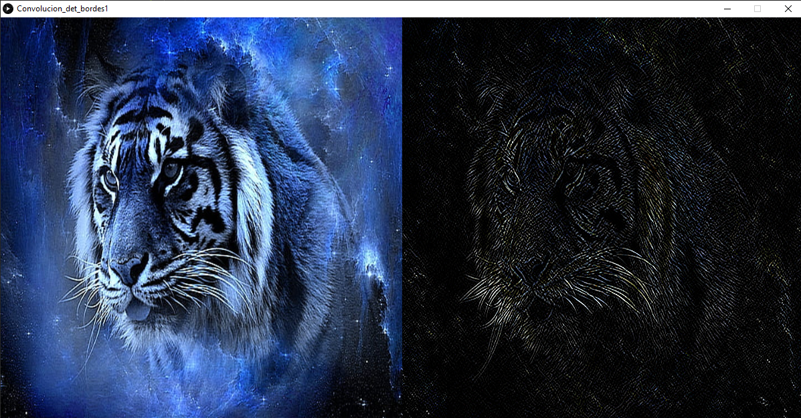

## Primera mascara de detección de bordes en video
Link al [código fuente](https://github.com/VisualUN/Processing/tree/master/Convolucion/Convolucion_det_bordes1_video)

```
PImage img;
import processing.video.*;
Movie myMovie;  

// It's possible to convolve the image with many different 
// matrices to produce different effects. This is a high-pass 
// filter; it accentuates the edges. 
float[][] matrix = { { 1, 0, -1},
                     { 0, 0, 0},
                     { -1, 0, 1}}; 
      
int mW;
int mH;
int matrixsize = 3;
void setup() {
  size(1200, 600);
  background(0);
  myMovie = new Movie(this, "video.mp4");
  myMovie.loop();
  myMovie.volume(0);
}

void draw() {  
  if (myMovie.available()) {
    myMovie.read();
  }
  
  image(myMovie, 0, 0, width/2, height);  
  for (int x = width/2; x < width; x++) {
    for (int y = 0; y < height; y++ ) {
      float rtotal = 0.0;
      float gtotal = 0.0;
      float btotal = 0.0;
      int offset = matrixsize / 2;
      for (int i=0; i < matrixsize; i++){
        for (int j=0; j < matrixsize; j++){
          int xloc = x+i-offset;
          int yloc = y+j-offset;
          int loc = xloc + (myMovie.width)*yloc;
          
          loc = constrain(loc,0,myMovie.pixels.length-1);
          // Calculate the convolution
          if(loc > 0){
            rtotal += (red(myMovie.pixels[loc]) * matrix[i][j]);
            gtotal += (green(myMovie.pixels[loc]) * matrix[i][j]);
            btotal += (blue(myMovie.pixels[loc]) * matrix[i][j]); 
          }
        }
      } 
      rtotal = constrain(rtotal, 0, 255);
      gtotal = constrain(gtotal, 0, 255);
      btotal = constrain(btotal, 0, 255);
      
      color Color = color(rtotal, gtotal, btotal);
      set(x, y, Color);
    }
  }  
}
```

## Segunda mascara de detección de bordes en imagenes
Link al [código fuente](https://github.com/VisualUN/Processing/tree/master/Convolucion/Convolucion_det_bordes2)

```
PImage img;
int w = 120;

// It's possible to convolve the image with many different 
// matrices to produce different effects. This is a high-pass 
// filter; it accentuates the edges. 
float[][] matrix = { { 0, -1, 0},
                     { -1, 4, -1},
                     { 0, -1, 0}}; 

void setup() {
  size(1200, 600);
  img = loadImage("imagen3.jpg");
  img.resize(600, 600);
  image(img, width/2, 0, width, height);
  
  int matrixsize = 3;
  
  for (int x = width/2; x < width; x++) {
    for (int y = 0; y < height; y++ ) {
      color c = convolution(x, y, matrix, matrixsize, img);
      set(x, y, c);
    }
  }
  image(img, 0, 0, width/2, height);
}

void draw() {
}

color convolution(int x, int y, float[][] matrix, int matrixsize, PImage img)
{
  float rtotal = 0.0;
  float gtotal = 0.0;
  float btotal = 0.0;
  int offset = matrixsize / 2;
  for (int i = 0; i < matrixsize; i++){
    for (int j= 0; j < matrixsize; j++){
      // What pixel are we testing
      int xloc = x+i-offset;
      int yloc = y+j-offset;
      int loc = xloc + img.width*yloc;
      // Make sure we haven't walked off our image, we could do better here
      loc = constrain(loc,0,img.pixels.length-1);
      // Calculate the convolution
      rtotal += (red(img.pixels[loc]) * matrix[i][j]);
      gtotal += (green(img.pixels[loc]) * matrix[i][j]);
      btotal += (blue(img.pixels[loc]) * matrix[i][j]);
    }
  }
  // Make sure RGB is within range
  rtotal = constrain(rtotal, 0, 255);
  gtotal = constrain(gtotal, 0, 255);
  btotal = constrain(btotal, 0, 255);
  // Return the resulting color
  return color(rtotal, gtotal, btotal);
}
```
### Resultado:
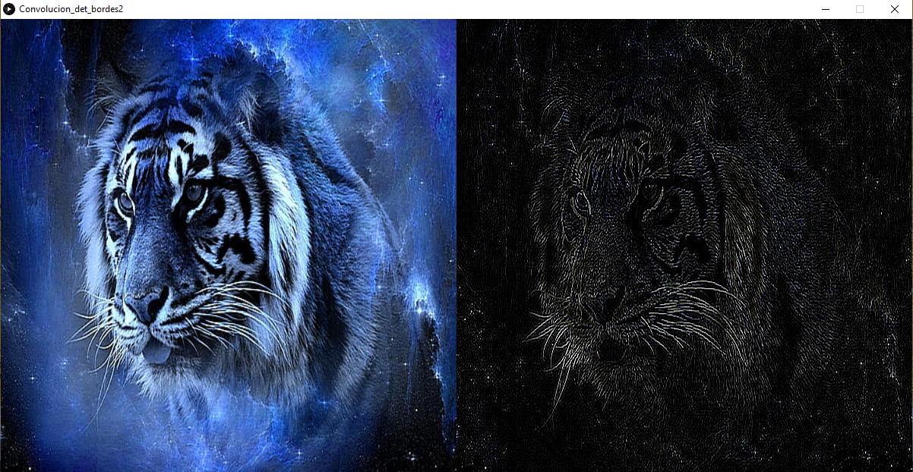

## Segunda mascara de detección de bordes en video
Link al [código fuente](https://github.com/VisualUN/Processing/tree/master/Convolucion/Convolucion_det_bordes2_video)

```
PImage img;
import processing.video.*;
Movie myMovie;  

// It's possible to convolve the image with many different 
// matrices to produce different effects. This is a high-pass 
// filter; it accentuates the edges. 
float[][] matrix = { { 0, -1, 0},
                     { -1, 4, -1},
                     { 0, -1, 0}}; 
      
int matrixsize = 3;
void setup() {
  size(1200, 600);
  background(0);
  myMovie = new Movie(this, "video.mp4");
  myMovie.loop();
  myMovie.volume(0);
}

void draw() {  
  if (myMovie.available()) {
    myMovie.read();
  }
  
  image(myMovie, 0, 0, width/2, height);
  for (int x = width/2; x < width; x++) {
    for (int y = 0; y < height; y++ ) {
      float rtotal = 0.0;
      float gtotal = 0.0;
      float btotal = 0.0;
      int offset = matrixsize / 2;
      for (int i=0; i < matrixsize; i++){
        for (int j=0; j < matrixsize; j++){
          int xloc = x+i-offset;
          int yloc = y+j-offset;
          int loc = xloc + (myMovie.width)*yloc;
          
          loc = constrain(loc,0,myMovie.pixels.length-1);
          // Calculate the convolution
          if(loc > 0){
            rtotal += (red(myMovie.pixels[loc]) * matrix[i][j]);
            gtotal += (green(myMovie.pixels[loc]) * matrix[i][j]);
            btotal += (blue(myMovie.pixels[loc]) * matrix[i][j]); 
          }
        }
      } 
      rtotal = constrain(rtotal, 0, 255);
      gtotal = constrain(gtotal, 0, 255);
      btotal = constrain(btotal, 0, 255);
      
      color Color = color(rtotal, gtotal, btotal);
      set(x, y, Color);
    }
  }  
}
```

## Tercera mascara de detección de bordes en imagenes
Link al [código fuente](https://github.com/VisualUN/Processing/tree/master/Convolucion/Convolucion_det_bordes3)

```
PImage img;
int w = 120;

// It's possible to convolve the image with many different 
// matrices to produce different effects. This is a high-pass 
// filter; it accentuates the edges. 
float[][] matrix = { { -1, -1, -1},
                     { -1, 8, -1},
                     { -1, -1, -1}}; 

void setup() {
  size(1200, 600);
  img = loadImage("imagen3.jpg");
  img.resize(600, 600);
  image(img, width/2, 0, width, height);
  
  int matrixsize = 3;
  
  for (int x = width/2; x < width; x++) {
    for (int y = 0; y < height; y++ ) {
      color c = convolution(x, y, matrix, matrixsize, img);
      set(x, y, c);
    }
  }
  image(img, 0, 0, width/2, height);
}

void draw() {
}

color convolution(int x, int y, float[][] matrix, int matrixsize, PImage img)
{
  float rtotal = 0.0;
  float gtotal = 0.0;
  float btotal = 0.0;
  int offset = matrixsize / 2;
  for (int i = 0; i < matrixsize; i++){
    for (int j= 0; j < matrixsize; j++){
      // What pixel are we testing
      int xloc = x+i-offset;
      int yloc = y+j-offset;
      int loc = xloc + img.width*yloc;
      // Make sure we haven't walked off our image, we could do better here
      loc = constrain(loc,0,img.pixels.length-1);
      // Calculate the convolution
      rtotal += (red(img.pixels[loc]) * matrix[i][j]);
      gtotal += (green(img.pixels[loc]) * matrix[i][j]);
      btotal += (blue(img.pixels[loc]) * matrix[i][j]);
    }
  }
  // Make sure RGB is within range
  rtotal = constrain(rtotal, 0, 255);
  gtotal = constrain(gtotal, 0, 255);
  btotal = constrain(btotal, 0, 255);
  // Return the resulting color
  return color(rtotal, gtotal, btotal);
}
```
### Resultado:
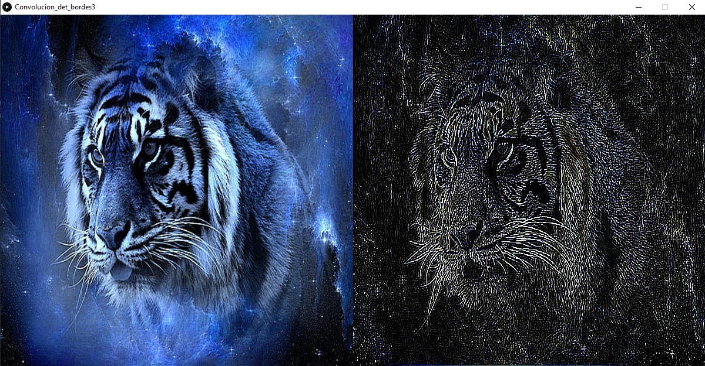

## Tercera mascara de detección de bordes en video
Link al [código fuente](https://github.com/VisualUN/Processing/tree/master/Convolucion/Convolucion_det_bordes3_video)

```
PImage img;
import processing.video.*;
Movie myMovie;  

// It's possible to convolve the image with many different 
// matrices to produce different effects. This is a high-pass 
// filter; it accentuates the edges. 
float[][] matrix = { { -1, -1, -1},
                     { -1, 8, -1},
                     { -1, -1, -1}};

int matrixsize = 3;
void setup() {
  size(1200, 600);
  background(0);
  myMovie = new Movie(this, "video.mp4");
  myMovie.loop();
  myMovie.volume(0);
}

void draw() {  
  if (myMovie.available()) {
    myMovie.read();
  }
  
  image(myMovie, 0, 0, width/2, height);
  for (int x = width/2; x < width; x++) {
    for (int y = 0; y < height; y++ ) {
      float rtotal = 0.0;
      float gtotal = 0.0;
      float btotal = 0.0;
      int offset = matrixsize / 2;
      for (int i=0; i < matrixsize; i++){
        for (int j=0; j < matrixsize; j++){
          int xloc = x+i-offset;
          int yloc = y+j-offset;
          int loc = xloc + (myMovie.width)*yloc;
          
          loc = constrain(loc,0,myMovie.pixels.length-1);
          // Calculate the convolution
          if(loc > 0){
            rtotal += (red(myMovie.pixels[loc]) * matrix[i][j]);
            gtotal += (green(myMovie.pixels[loc]) * matrix[i][j]);
            btotal += (blue(myMovie.pixels[loc]) * matrix[i][j]); 
          }
        }
      } 
      rtotal = constrain(rtotal, 0, 255);
      gtotal = constrain(gtotal, 0, 255);
      btotal = constrain(btotal, 0, 255);
      
      color Color = color(rtotal, gtotal, btotal);
      set(x, y, Color);
    }
  }  
}
```
## Mascara identidad en imagenes
Link al [código fuente](https://github.com/VisualUN/Processing/tree/master/Convolucion/Convolucion_identidad)

```
PImage img;
int w = 120;

// It's possible to convolve the image with many different 
// matrices to produce different effects. This is a high-pass 
// filter; it accentuates the edges. 
float[][] matrix = { { 0, 0, 0},
                     { 0, 1, 0},
                     { 0, 0, 0}}; 

void setup() {
  size(1200, 600);
  img = loadImage("imagen3.jpg"); 
  img.resize(600, 600);
  image(img, width/2, 0, width, height);
  
  int matrixsize = 3;  
  for (int x = width/2; x < width; x++) {
    for (int y = 0; y < height; y++ ) {
      color c = convolution(x, y, matrix, matrixsize, img);
      set(x, y, c);
    }
  }
  image(img, 0, 0, width/2, height);
}

void draw() {
}

color convolution(int x, int y, float[][] matrix, int matrixsize, PImage img)
{
  float rtotal = 0.0;
  float gtotal = 0.0;
  float btotal = 0.0;
  int offset = matrixsize / 2;
  for (int i = 0; i < matrixsize; i++){
    for (int j= 0; j < matrixsize; j++){
      // What pixel are we testing
      int xloc = x+i-offset;
      int yloc = y+j-offset;
      int loc = xloc + img.width*yloc;
      // Make sure we haven't walked off our image, we could do better here
      loc = constrain(loc,0,img.pixels.length-1);
      // Calculate the convolution
      rtotal += (red(img.pixels[loc]) * matrix[i][j]);
      gtotal += (green(img.pixels[loc]) * matrix[i][j]);
      btotal += (blue(img.pixels[loc]) * matrix[i][j]);
    }
  }
  // Make sure RGB is within range
  rtotal = constrain(rtotal, 0, 255);
  gtotal = constrain(gtotal, 0, 255);
  btotal = constrain(btotal, 0, 255);
  // Return the resulting color
  return color(rtotal, gtotal, btotal);
}
```
### Resultado:
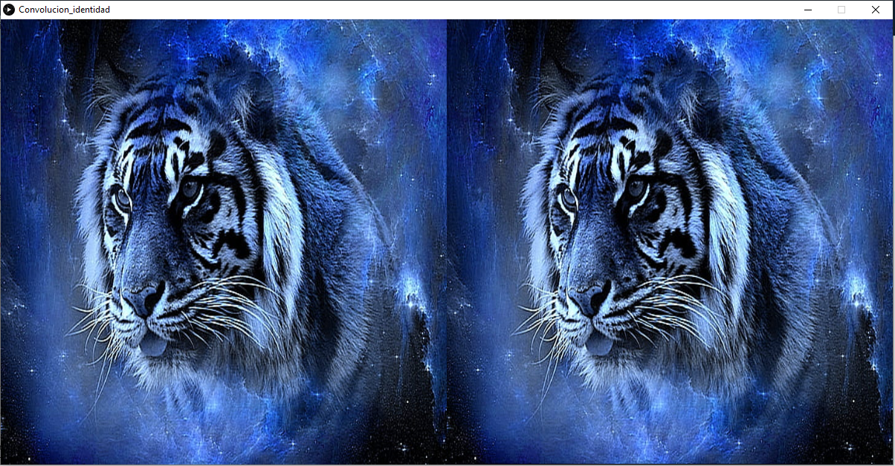

## Mascara identidad en video
Link al [código fuente](https://github.com/VisualUN/Processing/tree/master/Convolucion/Convolucion_identidad_video)

```
PImage img;
import processing.video.*;
Movie myMovie;  

// It's possible to convolve the image with many different 
// matrices to produce different effects. This is a high-pass 
// filter; it accentuates the edges. 
float[][] matrix = { { 0, 0, 0},
                     { 0, 1, 0},
                     { 0, 0, 0}}; 
      
int mW;
int mH;
int matrixsize = 3;
void setup() {
  size(1200, 600);
  background(0);
  myMovie = new Movie(this, "video.mp4");
  myMovie.loop();
  myMovie.volume(0);
}

void draw() {  
  if (myMovie.available()) {
    myMovie.read();
  }
  
  image(myMovie, 0, 0, width/2, height);  
  for (int x = width/2; x < width; x++) {
    for (int y = 0; y < height; y++ ) {
      float rtotal = 0.0;
      float gtotal = 0.0;
      float btotal = 0.0;
      int offset = matrixsize / 2;
      for (int i=0; i < matrixsize; i++){
        for (int j=0; j < matrixsize; j++){
          int xloc = x+i-offset;
          int yloc = y+j-offset;
          int loc = xloc + (myMovie.width)*yloc;
          
          loc = constrain(loc,0,myMovie.pixels.length-1);
          // Calculate the convolution
          if(loc > 0){
            rtotal += (red(myMovie.pixels[loc]) * matrix[i][j]);
            gtotal += (green(myMovie.pixels[loc]) * matrix[i][j]);
            btotal += (blue(myMovie.pixels[loc]) * matrix[i][j]); 
          }
        }
      } 
      rtotal = constrain(rtotal, 0, 255);
      gtotal = constrain(gtotal, 0, 255);
      btotal = constrain(btotal, 0, 255);
      
      color Color = color(rtotal, gtotal, btotal);
      set(x, y, Color);
    }
  }  
}
```

## Mascara de enfoque con matrix 5x5 en imagenes
Link al [código fuente](https://github.com/VisualUN/Processing/tree/master/Convolucion/Convolucion_Masc_Desenf5x5)

```
PImage img;
int w = 120;

// It's possible to convolve the image with many different 
// matrices to produce different effects. This is a high-pass 
// filter; it accentuates the edges. 
float[][] matrix = { { 1, 4, 6, 4, 1},
                     { 4, 16, 24, 16, 4},
                     { 6, 24, -476, 24, 6},
                     { 4, 16, 24, 16, 4},
                     { 1, 4, 6, 4, 1}}; 

void setup() {
  size(1200, 600);
  img = loadImage("imagen3.jpg"); 
  img.resize(600, 600);
  image(img, width/2, 0, width, height);
  
  int matrixsize = 5;
  
  for (int x = width/2; x < width; x++) {
    for (int y = 0; y < height; y++ ) {
      color c = convolution(x, y, matrix, matrixsize, img);
      set(x, y, c);
    }
  }
  image(img, 0, 0, width/2, height);
}

void draw() {
}

color convolution(int x, int y, float[][] matrix, int matrixsize, PImage img)
{
  float rtotal = 0.0;
  float gtotal = 0.0;
  float btotal = 0.0;
  int offset = matrixsize / 2;
  for (int i = 0; i < matrixsize; i++){
    for (int j= 0; j < matrixsize; j++){
      // What pixel are we testing
      int xloc = x+i-offset;
      int yloc = y+j-offset;
      int loc = xloc + img.width*yloc;
      // Make sure we haven't walked off our image, we could do better here
      loc = constrain(loc,0,img.pixels.length-1);
      // Calculate the convolution
      rtotal += (red(img.pixels[loc]) * -1/256 * matrix[i][j]);
      gtotal += (green(img.pixels[loc]) * -1/256 * matrix[i][j]);
      btotal += (blue(img.pixels[loc]) * -1/256 * matrix[i][j]);
    }
  }
  // Make sure RGB is within range
  rtotal = constrain(rtotal, 0, 255);
  gtotal = constrain(gtotal, 0, 255);
  btotal = constrain(btotal, 0, 255);
  // Return the resulting color
  return color(rtotal, gtotal, btotal);
}
```
### Resultado:
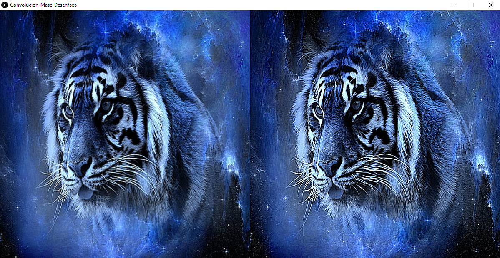

## Mascara de enfoque con matrix 5x5 en video
Link al [código fuente](https://github.com/VisualUN/Processing/tree/master/Convolucion/Convolucion_Masc_Desenf5x5_video)

```
PImage img;
import processing.video.*;
Movie myMovie;  

// It's possible to convolve the image with many different 
// matrices to produce different effects. This is a high-pass 
// filter; it accentuates the edges. 
float[][] matrix = { { 1, 4, 6, 4, 1},
                     { 4, 16, 24, 16, 4},
                     { 6, 24, -476, 24, 6},
                     { 4, 16, 24, 16, 4},
                     { 1, 4, 6, 4, 1}}; 
      
int matrixsize = 5;
void setup() {
  size(1200, 600);
  background(0);
  myMovie = new Movie(this, "video.mp4");
  myMovie.loop();
  myMovie.volume(0);
}

void draw() {  
  if (myMovie.available()) {
    myMovie.read();
  }
  
  image(myMovie, 0, 0, width/2, height);
  for (int x = width/2; x < width; x++) {
    for (int y = 0; y < height; y++ ) {
      float rtotal = 0.0;
      float gtotal = 0.0;
      float btotal = 0.0;
      int offset = matrixsize / 2;
      for (int i=0; i < matrixsize; i++){
        for (int j=0; j < matrixsize; j++){
          int xloc = x+i-offset;
          int yloc = y+j-offset;
          int loc = xloc + (myMovie.width)*yloc;
          
          loc = constrain(loc,0,myMovie.pixels.length-1);
          // Calculate the convolution
          if(loc > 0){
            rtotal += (red(myMovie.pixels[loc]) * -1/256 * matrix[i][j]);
            gtotal += (green(myMovie.pixels[loc]) * -1/256 * matrix[i][j]);
            btotal += (blue(myMovie.pixels[loc]) * -1/256 * matrix[i][j]); 
          }
        }
      } 
      rtotal = constrain(rtotal, 0, 255);
      gtotal = constrain(gtotal, 0, 255);
      btotal = constrain(btotal, 0, 255);
      
      color Color = color(rtotal, gtotal, btotal);
      set(x, y, Color);
    }
  }  
}
```

## Mascara de deteccion de lineas en 45 grados
Link al [código fuente](https://github.com/VisualUN/Processing/tree/master/convolution/Convolution_45_line_det)
```
PImage img;
int w = 120;
// Convolution example based on the one made by Daniel Shiffman. 
// It's possible to convolve the image with many different 
// matrices to produce different effects. This detects 45 degree lines 
float[][] matrix = { { -1, -1, 2 },
                     { -1, 2, -1 },
                     { 2, -1, -1 } };

void setup() {
  size(800, 400);
  img = loadImage("rgb.jpg"); 
  img.resize(400, 400);
  image(img, width/2, 0, width, height);
  int matrixsize = 3;
  
  for (int x = width/2; x < width; x++) {
    for (int y = 0; y < height; y++ ) {
      color c = convolution(x, y, matrix, matrixsize, img);
      set(x, y, c);
    }
  }
  //updatePixels();
  image(img, 0, 0, width/2, height);
}

void draw() {
  
}

color convolution(int x, int y, float[][] matrix, int matrixsize, PImage img)
{
  float rtotal = 0.0;
  float gtotal = 0.0;
  float btotal = 0.0;
  int offset = matrixsize / 2;
  for (int i = 0; i < matrixsize; i++){
    for (int j= 0; j < matrixsize; j++){
      // What pixel are we testing
      int xloc = x+i-offset;
      int yloc = y+j-offset;
      int loc = xloc + img.width*yloc;
      // Make sure we haven't walked off our image, we could do better here
      loc = constrain(loc,0,img.pixels.length-1);
      // Calculate the convolution
      rtotal += (red(img.pixels[loc]) * matrix[i][j]);
      gtotal += (green(img.pixels[loc]) * matrix[i][j]);
      btotal += (blue(img.pixels[loc]) * matrix[i][j]);
    }
  }
  // Make sure RGB is within range
  rtotal = constrain(rtotal, 0, 255);
  gtotal = constrain(gtotal, 0, 255);
  btotal = constrain(btotal, 0, 255);
  // Return the resulting color
  return color(rtotal, gtotal, btotal);
}
```
### Resultado:


## Mascara de deteccion de lineas en 135 grados
Link al [código fuente](https://github.com/VisualUN/Processing/tree/master/convolution/Convolution_135_line_det)
```
PImage img;
int w = 120;
// Convolution example based on the one made by Daniel Shiffman. 
// It's possible to convolve the image with many different 
// matrices to produce different effects. This detects 135 degree lines 
float[][] matrix = { { 2, -1, -1 },
                     { -1, 2, -1 },
                     {-1, -1, 2 } };

void setup() {
  size(800, 400);
  img = loadImage("rgb.jpg"); 
  img.resize(400, 400);
  image(img, width/2, 0, width, height);
  int matrixsize = 3;
  
  for (int x = width/2; x < width; x++) {
    for (int y = 0; y < height; y++ ) {
      color c = convolution(x, y, matrix, matrixsize, img);
      set(x, y, c);
    }
  }
  //updatePixels();
  image(img, 0, 0, width/2, height);
}

void draw() {
  
}

color convolution(int x, int y, float[][] matrix, int matrixsize, PImage img)
{
  float rtotal = 0.0;
  float gtotal = 0.0;
  float btotal = 0.0;
  int offset = matrixsize / 2;
  for (int i = 0; i < matrixsize; i++){
    for (int j= 0; j < matrixsize; j++){
      // What pixel are we testing
      int xloc = x+i-offset;
      int yloc = y+j-offset;
      int loc = xloc + img.width*yloc;
      // Make sure we haven't walked off our image, we could do better here
      loc = constrain(loc,0,img.pixels.length-1);
      // Calculate the convolution
      rtotal += (red(img.pixels[loc]) * matrix[i][j]);
      gtotal += (green(img.pixels[loc]) * matrix[i][j]);
      btotal += (blue(img.pixels[loc]) * matrix[i][j]);
    }
  }
  // Make sure RGB is within range
  rtotal = constrain(rtotal, 0, 255);
  gtotal = constrain(gtotal, 0, 255);
  btotal = constrain(btotal, 0, 255);
  // Return the resulting color
  return color(rtotal, gtotal, btotal);
}
```
### Resultado:


## Otra Mascara de desenfoque gaussiano
Link al [código fuente](https://github.com/VisualUN/Processing/tree/master/convolution/Convolution_gaussian)
```
PImage img;
int w = 120;
// Convolution example based on the one made by Daniel Shiffman. 
// It's possible to convolve the image with many different 
// matrices to produce different effects. This is another filter
//for a gaussian blur
float[][] matrix = { { 1, 1, 1 },
                     { 1, 4, 1 },
                     { 1, 1, 1 } };

void setup() {
  size(800, 400);
  img = loadImage("rgb.jpg"); 
  img.resize(400, 400);
  image(img, width/2, 0, width, height);
  int matrixsize = 3;
  
  for (int x = width/2; x < width; x++) {
    for (int y = 0; y < height; y++ ) {
      color c = convolution(x, y, matrix, matrixsize, img);
      set(x, y, c);
    }
  }
  //updatePixels();
  image(img, 0, 0, width/2, height);
}

void draw() {
  
}

color convolution(int x, int y, float[][] matrix, int matrixsize, PImage img)
{
  float rtotal = 0.0;
  float gtotal = 0.0;
  float btotal = 0.0;
  int offset = matrixsize / 2;
  for (int i = 0; i < matrixsize; i++){
    for (int j= 0; j < matrixsize; j++){
      // What pixel are we testing
      int xloc = x+i-offset;
      int yloc = y+j-offset;
      int loc = xloc + img.width*yloc;
      // Make sure we haven't walked off our image, we could do better here
      loc = constrain(loc,0,img.pixels.length-1);
      // Calculate the convolution
      rtotal += (red(img.pixels[loc]) * 1/8 * matrix[i][j]);
      gtotal += (green(img.pixels[loc]) * 1/8 * matrix[i][j]);
      btotal += (blue(img.pixels[loc]) * 1/8 * matrix[i][j]);
    }
  }
  // Make sure RGB is within range
  rtotal = constrain(rtotal, 0, 255);
  gtotal = constrain(gtotal, 0, 255);
  btotal = constrain(btotal, 0, 255);
  // Return the resulting color
  return color(rtotal, gtotal, btotal);
}
```
### Resultado:
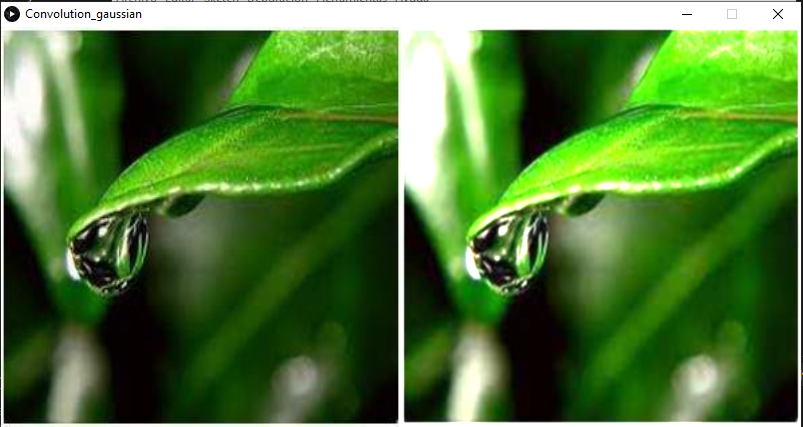

## Mascara de filtro pasa alta
Link al [código fuente](https://github.com/VisualUN/Processing/tree/master/convolution/Convolution_high_pass)
```
PImage img;
int w = 120;
// Convolution example based on the one made by Daniel Shiffman. 
// It's possible to convolve the image with many different 
// matrices to produce different effects. This is a high-pass 
// filter; it accentuates the edges. 
float[][] matrix = { { -1, -1, -1 },
                     { -1,  9, -1 },
                     { -1, -1, -1 } };

void setup() {
  size(800, 400);
  img = loadImage("rgb.jpg"); 
  img.resize(400, 400);
  image(img, width/2, 0, width, height);
  int matrixsize = 3;
  
  for (int x = width/2; x < width; x++) {
    for (int y = 0; y < height; y++ ) {
      color c = convolution(x, y, matrix, matrixsize, img);
      set(x, y, c);
    }
  }
  //updatePixels();
  image(img, 0, 0, width/2, height);
}

void draw() {
  
}

color convolution(int x, int y, float[][] matrix, int matrixsize, PImage img)
{
  float rtotal = 0.0;
  float gtotal = 0.0;
  float btotal = 0.0;
  int offset = matrixsize / 2;
  for (int i = 0; i < matrixsize; i++){
    for (int j= 0; j < matrixsize; j++){
      // What pixel are we testing
      int xloc = x+i-offset;
      int yloc = y+j-offset;
      int loc = xloc + img.width*yloc;
      // Make sure we haven't walked off our image, we could do better here
      loc = constrain(loc,0,img.pixels.length-1);
      // Calculate the convolution
      rtotal += (red(img.pixels[loc]) * matrix[i][j]);
      gtotal += (green(img.pixels[loc]) * matrix[i][j]);
      btotal += (blue(img.pixels[loc]) * matrix[i][j]);
    }
  }
  // Make sure RGB is within range
  rtotal = constrain(rtotal, 0, 255);
  gtotal = constrain(gtotal, 0, 255);
  btotal = constrain(btotal, 0, 255);
  // Return the resulting color
  return color(rtotal, gtotal, btotal);
}
```
### Resultado:
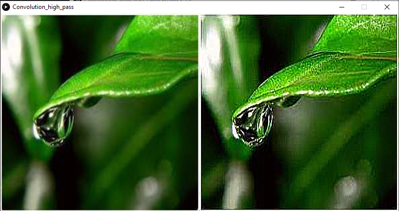

## Mascara de deteccion de lineas horizontales
Link al [código fuente](https://github.com/VisualUN/Processing/tree/master/convolution/Convolution_horizontal_line_det)
```
PImage img;
int w = 120;
// Convolution example based on the one made by Daniel Shiffman. 
// It's possible to convolve the image with many different 
// matrices to produce different effects. This is a horizontal line detector
float[][] matrix = { { -1, -1, -1 },
                     { 2, 2, 2 },
                     { -1, -1, -1 } };

void setup() {
  size(800, 400);
  img = loadImage("rgb.jpg"); 
  img.resize(400, 400);
  image(img, width/2, 0, width, height);
  int matrixsize = 3;
  
  for (int x = width/2; x < width; x++) {
    for (int y = 0; y < height; y++ ) {
      color c = convolution(x, y, matrix, matrixsize, img);
      set(x, y, c);
    }
  }
  //updatePixels();
  image(img, 0, 0, width/2, height);
}

void draw() {
  
}

color convolution(int x, int y, float[][] matrix, int matrixsize, PImage img)
{
  float rtotal = 0.0;
  float gtotal = 0.0;
  float btotal = 0.0;
  int offset = matrixsize / 2;
  for (int i = 0; i < matrixsize; i++){
    for (int j= 0; j < matrixsize; j++){
      // What pixel are we testing
      int xloc = x+i-offset;
      int yloc = y+j-offset;
      int loc = xloc + img.width*yloc;
      // Make sure we haven't walked off our image, we could do better here
      loc = constrain(loc,0,img.pixels.length-1);
      // Calculate the convolution
      rtotal += (red(img.pixels[loc]) * matrix[i][j]);
      gtotal += (green(img.pixels[loc]) * matrix[i][j]);
      btotal += (blue(img.pixels[loc]) * matrix[i][j]);
    }
  }
  // Make sure RGB is within range
  rtotal = constrain(rtotal, 0, 255);
  gtotal = constrain(gtotal, 0, 255);
  btotal = constrain(btotal, 0, 255);
  // Return the resulting color
  return color(rtotal, gtotal, btotal);
}
```
### Resultado:
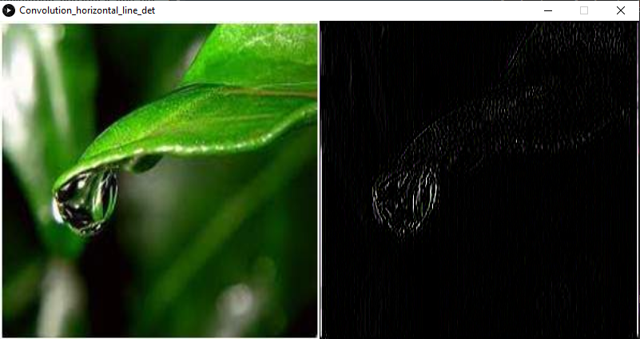

## Mascara de deteccion de lineas horizontales sobel
Link al [código fuente](https://github.com/VisualUN/Processing/tree/master/convolution/Convolution_horizontal_sobel_edge_line_det)
```
PImage img;
int w = 120;
// Convolution example based on the one made by Daniel Shiffman. 
// It's possible to convolve the image with many different 
// matrices to produce different effects. This is a horizontal sobel edge 
//operator, its used to reduce noise
float[][] matrix = { { -1, -2, -1 },
                     { 0, 0, 0 },
                     { 1, 2, 1 } };

void setup() {
  size(800, 400);
  img = loadImage("rgb.jpg"); 
  img.resize(400, 400);
  image(img, width/2, 0, width, height);
  int matrixsize = 3;
  
  for (int x = width/2; x < width; x++) {
    for (int y = 0; y < height; y++ ) {
      color c = convolution(x, y, matrix, matrixsize, img);
      set(x, y, c);
    }
  }
  //updatePixels();
  image(img, 0, 0, width/2, height);
}

void draw() {
  
}

color convolution(int x, int y, float[][] matrix, int matrixsize, PImage img)
{
  float rtotal = 0.0;
  float gtotal = 0.0;
  float btotal = 0.0;
  int offset = matrixsize / 2;
  for (int i = 0; i < matrixsize; i++){
    for (int j= 0; j < matrixsize; j++){
      // What pixel are we testing
      int xloc = x+i-offset;
      int yloc = y+j-offset;
      int loc = xloc + img.width*yloc;
      // Make sure we haven't walked off our image, we could do better here
      loc = constrain(loc,0,img.pixels.length-1);
      // Calculate the convolution
      rtotal += (red(img.pixels[loc]) * matrix[i][j]);
      gtotal += (green(img.pixels[loc]) * matrix[i][j]);
      btotal += (blue(img.pixels[loc]) * matrix[i][j]);
    }
  }
  // Make sure RGB is within range
  rtotal = constrain(rtotal, 0, 255);
  gtotal = constrain(gtotal, 0, 255);
  btotal = constrain(btotal, 0, 255);
  // Return the resulting color
  return color(rtotal, gtotal, btotal);
}
```
### Resultado:
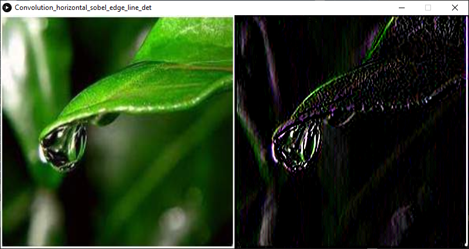

## Mascara de deteccion de lineas verticales
Link al [código fuente](https://github.com/VisualUN/Processing/tree/master/convolution/Convolution_vertical_line_det)
```
PImage img;
int w = 120;
// Convolution example based on the one made by Daniel Shiffman. 
// It's possible to convolve the image with many different 
// matrices to produce different effects. This detects the vertical lines 
float[][] matrix = { { -1, 2, -1 },
                     { -1, 2, -1 },
                     { -1, 2, -1 } };

void setup() {
  size(800, 400);
  img = loadImage("rgb.jpg"); 
  img.resize(400, 400);
  image(img, width/2, 0, width, height);
  int matrixsize = 3;
  
  for (int x = width/2; x < width; x++) {
    for (int y = 0; y < height; y++ ) {
      color c = convolution(x, y, matrix, matrixsize, img);
      set(x, y, c);
    }
  }
  //updatePixels();
  image(img, 0, 0, width/2, height);
}

void draw() {
  
}

color convolution(int x, int y, float[][] matrix, int matrixsize, PImage img)
{
  float rtotal = 0.0;
  float gtotal = 0.0;
  float btotal = 0.0;
  int offset = matrixsize / 2;
  for (int i = 0; i < matrixsize; i++){
    for (int j= 0; j < matrixsize; j++){
      // What pixel are we testing
      int xloc = x+i-offset;
      int yloc = y+j-offset;
      int loc = xloc + img.width*yloc;
      // Make sure we haven't walked off our image, we could do better here
      loc = constrain(loc,0,img.pixels.length-1);
      // Calculate the convolution
      rtotal += (red(img.pixels[loc]) * matrix[i][j]);
      gtotal += (green(img.pixels[loc]) * matrix[i][j]);
      btotal += (blue(img.pixels[loc]) * matrix[i][j]);
    }
  }
  // Make sure RGB is within range
  rtotal = constrain(rtotal, 0, 255);
  gtotal = constrain(gtotal, 0, 255);
  btotal = constrain(btotal, 0, 255);
  // Return the resulting color
  return color(rtotal, gtotal, btotal);
}
```
### Resultado:
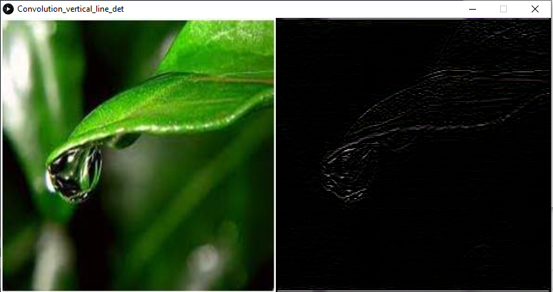

## Mascara de deteccion de lineas verticales sobel
Link al [código fuente](https://github.com/VisualUN/Processing/tree/master/convolution/Convolution_verticall_sobel_edge_line_det)
```
PImage img;
int w = 120;
// Convolution example based on the one made by Daniel Shiffman. 
// It's possible to convolve the image with many different 
// matrices to produce different effects. This is a vertical sobel edge 
//operator, its used to reduce noise
float[][] matrix = { { -1, 0, 1 },
                     { -2, 0, 2 },
                     { -1, 0, 1 } };

void setup() {
  size(800, 400);
  img = loadImage("rgb.jpg"); 
  img.resize(400, 400);
  image(img, width/2, 0, width, height);
  int matrixsize = 3;
  
  for (int x = width/2; x < width; x++) {
    for (int y = 0; y < height; y++ ) {
      color c = convolution(x, y, matrix, matrixsize, img);
      set(x, y, c);
    }
  }
  //updatePixels();
  image(img, 0, 0, width/2, height);
}

void draw() {
  
}

color convolution(int x, int y, float[][] matrix, int matrixsize, PImage img)
{
  float rtotal = 0.0;
  float gtotal = 0.0;
  float btotal = 0.0;
  int offset = matrixsize / 2;
  for (int i = 0; i < matrixsize; i++){
    for (int j= 0; j < matrixsize; j++){
      // What pixel are we testing
      int xloc = x+i-offset;
      int yloc = y+j-offset;
      int loc = xloc + img.width*yloc;
      // Make sure we haven't walked off our image, we could do better here
      loc = constrain(loc,0,img.pixels.length-1);
      // Calculate the convolution
      rtotal += (red(img.pixels[loc]) * matrix[i][j]);
      gtotal += (green(img.pixels[loc]) * matrix[i][j]);
      btotal += (blue(img.pixels[loc]) * matrix[i][j]);
    }
  }
  // Make sure RGB is within range
  rtotal = constrain(rtotal, 0, 255);
  gtotal = constrain(gtotal, 0, 255);
  btotal = constrain(btotal, 0, 255);
  // Return the resulting color
  return color(rtotal, gtotal, btotal);
}
```
### Resultado:
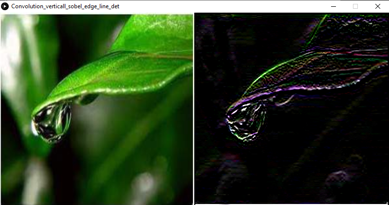
This is a link to [another document.](doc3.md)  
This is a link to an [external page.](http://www.example.com)

