## Rendimiento computacional para afilar en video
Link al [código fuente](https://github.com/VisualUN/Processing/tree/master/Convolucion/Convolucion_afilar_video)
```
PImage img;
import processing.video.*;
Movie myMovie;  
PFont font, f;
int resolution = 5;
// It's possible to convolve the image with many different 
// matrices to produce different effects. This is a high-pass 
// filter; it accentuates the edges. 
float[][] matrix = { { 0, -1, 0},
                     { -1, 5, -1},
                     { 0, -1, 0}};

int matrixsize = 3;
void setup() {
  size(1200, 600);
  frameRate(60);
  background(0);
  font = createFont("Courier", resolution + 3);
  f = createFont("Arial",16,true);
  myMovie = new Movie(this, "video.mp4");
  myMovie.loop();
  myMovie.volume(0);  
}

void draw() {  
  if (myMovie.available()) {
    myMovie.read();
  }
  
  image(myMovie, 0, 0, width/2, height);
  
  for (int x = width/2; x < width; x++) {
    for (int y = 0; y < height; y++ ) {
      float rtotal = 0.0;
      float gtotal = 0.0;
      float btotal = 0.0;
      int offset = matrixsize / 2;
      for (int i=0; i < matrixsize; i++){
        for (int j=0; j < matrixsize; j++){
          int xloc = x+i-offset;
          int yloc = y+j-offset;
          int loc = xloc + (myMovie.width)*yloc;
          
          loc = constrain(loc,0,myMovie.pixels.length-1);
          // Calculate the convolution
          if(loc > 0){
            rtotal += (red(myMovie.pixels[loc]) * matrix[i][j]);
            gtotal += (green(myMovie.pixels[loc]) * matrix[i][j]);
            btotal += (blue(myMovie.pixels[loc]) * matrix[i][j]); 
          }
        }
      } 
      rtotal = constrain(rtotal, 0, 255);
      gtotal = constrain(gtotal, 0, 255);
      btotal = constrain(btotal, 0, 255);
      
      color Color = color(rtotal, gtotal, btotal);
      set(x, y, Color);
    }
  }
  textFont(f,18);
  fill(255);
  text("FPS: " + nf(frameRate, 0, 2), 1100, 20);
}
```
### Resultado:
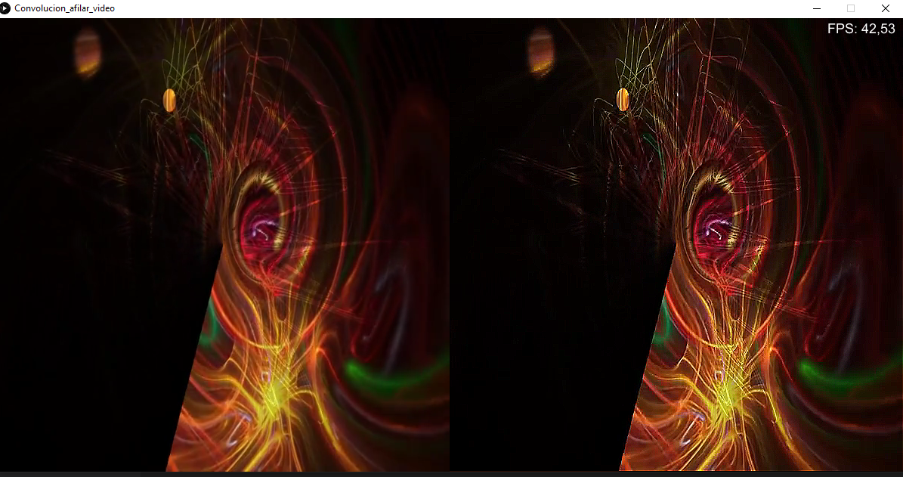


## ## Rendimiento computacional para desenfocar en video
Link al [código fuente](https://github.com/VisualUN/Processing/tree/master/Convolucion/Convolucion_desenfoque_video)

```
PImage img;
import processing.video.*;
Movie myMovie;  
PFont font, f;
int resolution = 5;
// It's possible to convolve the image with many different 
// matrices to produce different effects. This is a high-pass 
// filter; it accentuates the edges. 
float[][] matrix = { { 1, 1, 1},
                     { 1, 1, 1},
                     { 1, 1, 1}}; 

int matrixsize = 3;
void setup() {
  size(1200, 600);
  frameRate(60);
  background(0);
  font = createFont("Courier", resolution + 3);
  f = createFont("Arial",16,true);
  myMovie = new Movie(this, "video.mp4");
  myMovie.loop();
  myMovie.volume(0);  
}

void draw() {  
  if (myMovie.available()) {
    myMovie.read();
  }
  
  image(myMovie, 0, 0, width/2, height);
  
  for (int x = width/2; x < width; x++) {
    for (int y = 0; y < height; y++ ) {
      float rtotal = 0.0;
      float gtotal = 0.0;
      float btotal = 0.0;
      int offset = matrixsize / 2;
      for (int i=0; i < matrixsize; i++){
        for (int j=0; j < matrixsize; j++){
          int xloc = x+i-offset;
          int yloc = y+j-offset;
          int loc = xloc + (myMovie.width)*yloc;
          
          loc = constrain(loc,0,myMovie.pixels.length-1);
          // Calculate the convolution
          if(loc > 0){
            rtotal += (red(myMovie.pixels[loc]) * 1/9 * matrix[i][j]);
            gtotal += (green(myMovie.pixels[loc]) * 1/9  * matrix[i][j]);
            btotal += (blue(myMovie.pixels[loc]) * 1/9  * matrix[i][j]); 
          }
        }
      } 
      rtotal = constrain(rtotal, 0, 255);
      gtotal = constrain(gtotal, 0, 255);
      btotal = constrain(btotal, 0, 255);
      
      color Color = color(rtotal, gtotal, btotal);
      set(x, y, Color);
    }
  }
  textFont(f,18);
  fill(255);
  text("FPS: " + nf(frameRate, 0, 2), 1100, 20);
}
```
### Resultado:


## Rendimiento computacional para desenfoque Gaussiano con matriz 3x3 en video
Link al [código fuente](https://github.com/VisualUN/Processing/tree/master/Convolucion/Convolucion_desGauss3x3_video)

```
PImage img;
import processing.video.*;
Movie myMovie;  
PFont font, f;
int resolution = 5;
// It's possible to convolve the image with many different 
// matrices to produce different effects. This is a high-pass 
// filter; it accentuates the edges. 
float[][] matrix = { { 1, 2, 1},
                     { 2, 4, 2},
                     { 1, 2, 1}}; 

int matrixsize = 3;
void setup() {
  size(1200, 600);  
  background(0);
  font = createFont("Courier", resolution + 3);
  f = createFont("Arial",16,true);
  myMovie = new Movie(this, "video.mp4");
  myMovie.loop();
  myMovie.volume(0);  
}

void draw() {  
  if (myMovie.available()) {
    myMovie.read();
  }
  
  image(myMovie, 0, 0, width/2, height);
  
  for (int x = width/2; x < width; x++) {
    for (int y = 0; y < height; y++ ) {
      float rtotal = 0.0;
      float gtotal = 0.0;
      float btotal = 0.0;
      int offset = matrixsize / 2;
      for (int i=0; i < matrixsize; i++){
        for (int j=0; j < matrixsize; j++){
          int xloc = x+i-offset;
          int yloc = y+j-offset;
          int loc = xloc + (myMovie.width)*yloc;
          
          loc = constrain(loc,0,myMovie.pixels.length-1);
          // Calculate the convolution
          if(loc > 0){
            rtotal += (red(myMovie.pixels[loc]) * 1/16 * matrix[i][j]);
            gtotal += (green(myMovie.pixels[loc]) * 1/16 * matrix[i][j]);
            btotal += (blue(myMovie.pixels[loc]) * 1/16 * matrix[i][j]); 
          }
        }
      } 
      rtotal = constrain(rtotal, 0, 255);
      gtotal = constrain(gtotal, 0, 255);
      btotal = constrain(btotal, 0, 255);
      
      color Color = color(rtotal, gtotal, btotal);
      set(x, y, Color);
    }
  }
  textFont(f,18);
  fill(255);
  text("FPS: " + nf(frameRate, 0, 2), 1100, 20);
}
```
### Resultado:
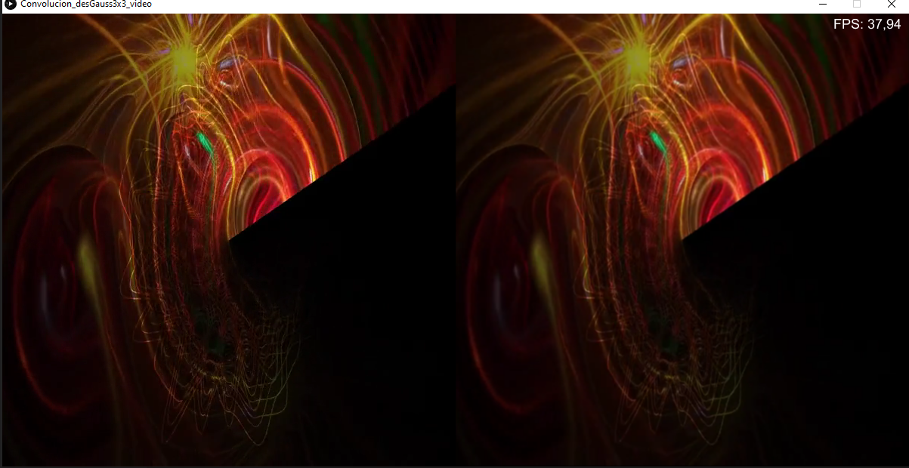


## Rendimiento computacional desenfoque Gaussiano con matriz 5x5 en video
Link al [código fuente](https://github.com/VisualUN/Processing/tree/master/Convolucion/Convolucion_desGauss5x5_video)

```
PImage img;
import processing.video.*;
Movie myMovie;  
PFont font, f;
int resolution = 5;
// It's possible to convolve the image with many different 
// matrices to produce different effects. This is a high-pass 
// filter; it accentuates the edges. 
float[][] matrix = { { 1, 4, 6, 4, 1},
                     { 4, 16, 24, 16, 4},
                     { 6, 24, 36, 24, 6},
                     { 4, 16, 24, 16, 4},
                     { 1, 4, 6, 4, 1}};

int matrixsize = 5;
void setup() {
  size(1200, 600);
  background(0);
  font = createFont("Courier", resolution + 3);
  f = createFont("Arial",16,true);
  myMovie = new Movie(this, "video.mp4");
  myMovie.loop();
  myMovie.volume(0);  
}

void draw() {  
  if (myMovie.available()) {
    myMovie.read();
  }
  
  image(myMovie, 0, 0, width/2, height);  
  for (int x = width/2; x < width; x++) {
    for (int y = 0; y < height; y++ ) {
      float rtotal = 0.0;
      float gtotal = 0.0;
      float btotal = 0.0;
      int offset = matrixsize / 2;
      for (int i=0; i < matrixsize; i++){
        for (int j=0; j < matrixsize; j++){
          int xloc = x+i-offset;
          int yloc = y+j-offset;
          int loc = xloc + (myMovie.width)*yloc;
          
          loc = constrain(loc,0,myMovie.pixels.length-1);
          // Calculate the convolution
          if(loc > 0){
            rtotal += (red(myMovie.pixels[loc]) * 1/256 * matrix[i][j]);
            gtotal += (green(myMovie.pixels[loc]) * 1/256 * matrix[i][j]);
            btotal += (blue(myMovie.pixels[loc]) * 1/256 * matrix[i][j]); 
          }
        }
      } 
      rtotal = constrain(rtotal, 0, 255);
      gtotal = constrain(gtotal, 0, 255);
      btotal = constrain(btotal, 0, 255);
      
      color Color = color(rtotal, gtotal, btotal);
      set(x, y, Color);
    }
  }
  textFont(f,18);
  fill(255);
  text("FPS: " + nf(frameRate, 0, 2), 1100, 20);
}
```
### Resultado:
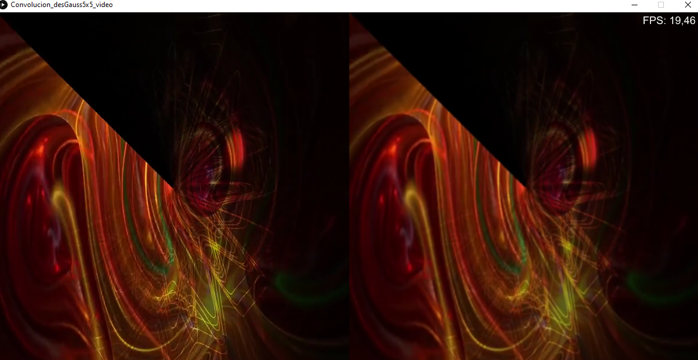


## Rendimiento computacional Primera mascara de detección de bordes en video
Link al [código fuente](https://github.com/VisualUN/Processing/tree/master/Convolucion/Convolucion_det_bordes1_video)

```
PImage img;
import processing.video.*;
Movie myMovie;  
PFont font, f;
int resolution = 5;
// It's possible to convolve the image with many different 
// matrices to produce different effects. This is a high-pass 
// filter; it accentuates the edges. 
float[][] matrix = { { 1, 0, -1},
                     { 0, 0, 0},
                     { -1, 0, 1}}; 
      
int mW;
int mH;
int matrixsize = 3;
void setup() {
  size(1200, 600);
  background(0);
  font = createFont("Courier", resolution + 3);
  f = createFont("Arial",16,true);
  myMovie = new Movie(this, "video.mp4");
  myMovie.loop();
  myMovie.volume(0);
}

void draw() {  
  if (myMovie.available()) {
    myMovie.read();
  }
  
  image(myMovie, 0, 0, width/2, height);  
  for (int x = width/2; x < width; x++) {
    for (int y = 0; y < height; y++ ) {
      float rtotal = 0.0;
      float gtotal = 0.0;
      float btotal = 0.0;
      int offset = matrixsize / 2;
      for (int i=0; i < matrixsize; i++){
        for (int j=0; j < matrixsize; j++){
          int xloc = x+i-offset;
          int yloc = y+j-offset;
          int loc = xloc + (myMovie.width)*yloc;
          
          loc = constrain(loc,0,myMovie.pixels.length-1);
          // Calculate the convolution
          if(loc > 0){
            rtotal += (red(myMovie.pixels[loc]) * matrix[i][j]);
            gtotal += (green(myMovie.pixels[loc]) * matrix[i][j]);
            btotal += (blue(myMovie.pixels[loc]) * matrix[i][j]); 
          }
        }
      } 
      rtotal = constrain(rtotal, 0, 255);
      gtotal = constrain(gtotal, 0, 255);
      btotal = constrain(btotal, 0, 255);
      
      color Color = color(rtotal, gtotal, btotal);
      set(x, y, Color);
    }
  }  
  textFont(f,18);
  fill(255);
  text("FPS: " + nf(frameRate, 0, 2), 1100, 20);
}
```
### Resultado:
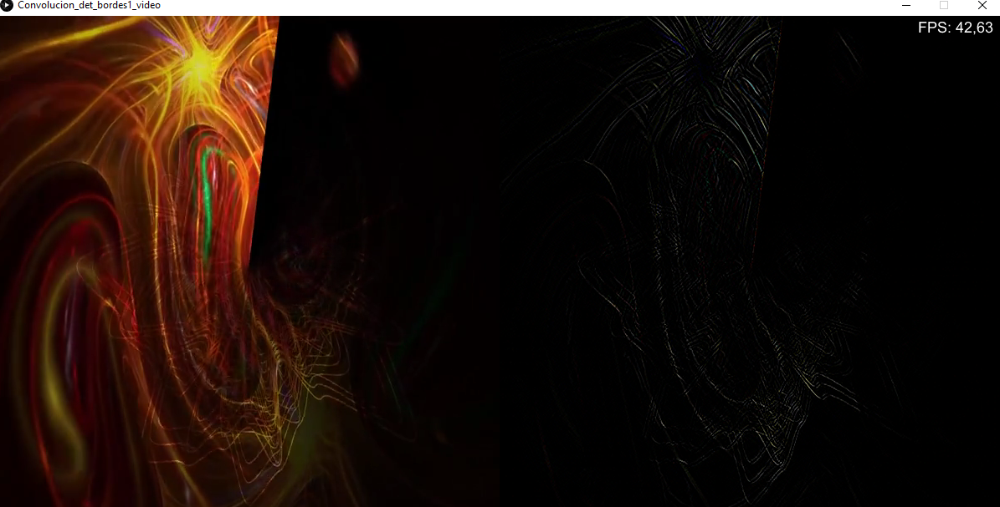


## Rendimiento computacional Segunda mascara de detección de bordes en video
Link al [código fuente](https://github.com/VisualUN/Processing/tree/master/Convolucion/Convolucion_det_bordes2_video)

```
PImage img;
import processing.video.*;
Movie myMovie;  
PFont font, f;
int resolution = 5;
// It's possible to convolve the image with many different 
// matrices to produce different effects. This is a high-pass 
// filter; it accentuates the edges. 
float[][] matrix = { { 0, -1, 0},
                     { -1, 4, -1},
                     { 0, -1, 0}}; 
      
int matrixsize = 3;
void setup() {
  size(1200, 600);
  background(0);
  font = createFont("Courier", resolution + 3);
  f = createFont("Arial",16,true);
  myMovie = new Movie(this, "video.mp4");
  myMovie.loop();
  myMovie.volume(0);
}

void draw() {  
  if (myMovie.available()) {
    myMovie.read();
  }
  
  image(myMovie, 0, 0, width/2, height);
  for (int x = width/2; x < width; x++) {
    for (int y = 0; y < height; y++ ) {
      float rtotal = 0.0;
      float gtotal = 0.0;
      float btotal = 0.0;
      int offset = matrixsize / 2;
      for (int i=0; i < matrixsize; i++){
        for (int j=0; j < matrixsize; j++){
          int xloc = x+i-offset;
          int yloc = y+j-offset;
          int loc = xloc + (myMovie.width)*yloc;
          
          loc = constrain(loc,0,myMovie.pixels.length-1);
          // Calculate the convolution
          if(loc > 0){
            rtotal += (red(myMovie.pixels[loc]) * matrix[i][j]);
            gtotal += (green(myMovie.pixels[loc]) * matrix[i][j]);
            btotal += (blue(myMovie.pixels[loc]) * matrix[i][j]); 
          }
        }
      } 
      rtotal = constrain(rtotal, 0, 255);
      gtotal = constrain(gtotal, 0, 255);
      btotal = constrain(btotal, 0, 255);
      
      color Color = color(rtotal, gtotal, btotal);
      set(x, y, Color);
    }
  }  
  textFont(f,18);
  fill(255);
  text("FPS: " + nf(frameRate, 0, 2), 1100, 20);
}
```
### Resultado:
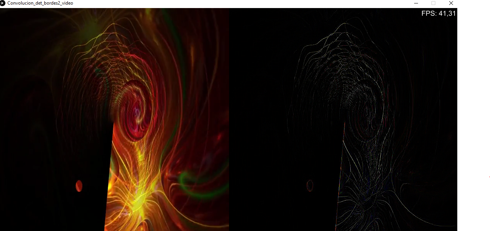


## Rendimiento computacional Tercera mascara de detección de bordes en video 
Link al [código fuente](https://github.com/VisualUN/Processing/tree/master/Convolucion/Convolucion_det_bordes3_video)

```
PImage img;
import processing.video.*;
Movie myMovie;  
PFont font, f;
int resolution = 5;
// It's possible to convolve the image with many different 
// matrices to produce different effects. This is a high-pass 
// filter; it accentuates the edges. 
float[][] matrix = { { -1, -1, -1},
                     { -1, 8, -1},
                     { -1, -1, -1}};

int matrixsize = 3;
void setup() {
  size(1200, 600);
  background(0);
  font = createFont("Courier", resolution + 3);
  f = createFont("Arial",16,true);
  myMovie = new Movie(this, "video.mp4");
  myMovie.loop();
  myMovie.volume(0);
}

void draw() {  
  if (myMovie.available()) {
    myMovie.read();
  }
  
  image(myMovie, 0, 0, width/2, height);
  for (int x = width/2; x < width; x++) {
    for (int y = 0; y < height; y++ ) {
      float rtotal = 0.0;
      float gtotal = 0.0;
      float btotal = 0.0;
      int offset = matrixsize / 2;
      for (int i=0; i < matrixsize; i++){
        for (int j=0; j < matrixsize; j++){
          int xloc = x+i-offset;
          int yloc = y+j-offset;
          int loc = xloc + (myMovie.width)*yloc;
          
          loc = constrain(loc,0,myMovie.pixels.length-1);
          // Calculate the convolution
          if(loc > 0){
            rtotal += (red(myMovie.pixels[loc]) * matrix[i][j]);
            gtotal += (green(myMovie.pixels[loc]) * matrix[i][j]);
            btotal += (blue(myMovie.pixels[loc]) * matrix[i][j]); 
          }
        }
      } 
      rtotal = constrain(rtotal, 0, 255);
      gtotal = constrain(gtotal, 0, 255);
      btotal = constrain(btotal, 0, 255);
      
      color Color = color(rtotal, gtotal, btotal);
      set(x, y, Color);
    }
  }
  textFont(f,18);
  fill(255);
  text("FPS: " + nf(frameRate, 0, 2), 1100, 20);
}
```
### Resultado:
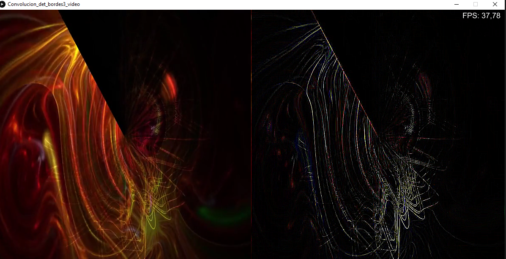


## Rendimiento computacional Mascara identidad en video
Link al [código fuente](https://github.com/VisualUN/Processing/tree/master/Convolucion/Convolucion_identidad_video)

```
PImage img;
import processing.video.*;
Movie myMovie;  
PFont font, f;
int resolution = 5;
// It's possible to convolve the image with many different 
// matrices to produce different effects. This is a high-pass 
// filter; it accentuates the edges. 
float[][] matrix = { { 0, 0, 0},
                     { 0, 1, 0},
                     { 0, 0, 0}}; 
      
int mW;
int mH;
int matrixsize = 3;
void setup() {
  size(1200, 600);
  background(0);
  font = createFont("Courier", resolution + 3);
  f = createFont("Arial",16,true);
  myMovie = new Movie(this, "video.mp4");
  myMovie.loop();
  myMovie.volume(0);
}

void draw() {  
  if (myMovie.available()) {
    myMovie.read();
  }
  
  image(myMovie, 0, 0, width/2, height);  
  for (int x = width/2; x < width; x++) {
    for (int y = 0; y < height; y++ ) {
      float rtotal = 0.0;
      float gtotal = 0.0;
      float btotal = 0.0;
      int offset = matrixsize / 2;
      for (int i=0; i < matrixsize; i++){
        for (int j=0; j < matrixsize; j++){
          int xloc = x+i-offset;
          int yloc = y+j-offset;
          int loc = xloc + (myMovie.width)*yloc;
          
          loc = constrain(loc,0,myMovie.pixels.length-1);
          // Calculate the convolution
          if(loc > 0){
            rtotal += (red(myMovie.pixels[loc]) * matrix[i][j]);
            gtotal += (green(myMovie.pixels[loc]) * matrix[i][j]);
            btotal += (blue(myMovie.pixels[loc]) * matrix[i][j]); 
          }
        }
      } 
      rtotal = constrain(rtotal, 0, 255);
      gtotal = constrain(gtotal, 0, 255);
      btotal = constrain(btotal, 0, 255);
      
      color Color = color(rtotal, gtotal, btotal);
      set(x, y, Color);
    }
  }  
  textFont(f,18);
  fill(255);
  text("FPS: " + nf(frameRate, 0, 2), 1100, 20);
}
```
### Resultado:
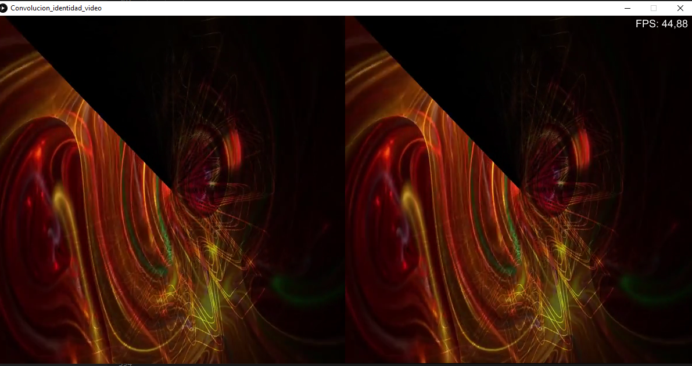


## Rendimiento computacional Mascara de enfoque con matrix 5x5 en video
Link al [código fuente](https://github.com/VisualUN/Processing/tree/master/Convolucion/Convolucion_Masc_Desenf5x5_video)

```
PImage img;
import processing.video.*;
Movie myMovie;  
PFont font, f;
int resolution = 5;
// It's possible to convolve the image with many different 
// matrices to produce different effects. This is a high-pass 
// filter; it accentuates the edges. 
float[][] matrix = { { 1, 4, 6, 4, 1},
                     { 4, 16, 24, 16, 4},
                     { 6, 24, -476, 24, 6},
                     { 4, 16, 24, 16, 4},
                     { 1, 4, 6, 4, 1}}; 
      
int matrixsize = 5;
void setup() {
  size(1200, 600);
  background(0);
  font = createFont("Courier", resolution + 3);
  f = createFont("Arial",16,true);
  myMovie = new Movie(this, "video.mp4");
  myMovie.loop();
  myMovie.volume(0);
}

void draw() {  
  if (myMovie.available()) {
    myMovie.read();
  }
  
  image(myMovie, 0, 0, width/2, height);
  for (int x = width/2; x < width; x++) {
    for (int y = 0; y < height; y++ ) {
      float rtotal = 0.0;
      float gtotal = 0.0;
      float btotal = 0.0;
      int offset = matrixsize / 2;
      for (int i=0; i < matrixsize; i++){
        for (int j=0; j < matrixsize; j++){
          int xloc = x+i-offset;
          int yloc = y+j-offset;
          int loc = xloc + (myMovie.width)*yloc;
          
          loc = constrain(loc,0,myMovie.pixels.length-1);
          // Calculate the convolution
          if(loc > 0){
            rtotal += (red(myMovie.pixels[loc]) * -1/256 * matrix[i][j]);
            gtotal += (green(myMovie.pixels[loc]) * -1/256 * matrix[i][j]);
            btotal += (blue(myMovie.pixels[loc]) * -1/256 * matrix[i][j]); 
          }
        }
      } 
      rtotal = constrain(rtotal, 0, 255);
      gtotal = constrain(gtotal, 0, 255);
      btotal = constrain(btotal, 0, 255);
      
      color Color = color(rtotal, gtotal, btotal);
      set(x, y, Color);
    }
  }  
  textFont(f,18);
  fill(255);
  text("FPS: " + nf(frameRate, 0, 2), 1100, 20);
}
```
### Resultado:
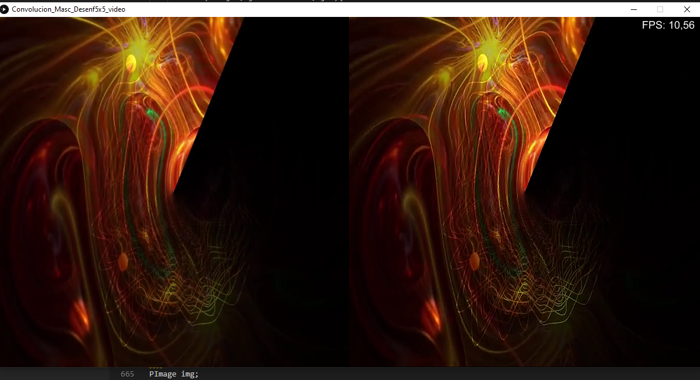

## Rendimiento computacional greyScale en video
Link al [código fuente](https://github.com/VisualUN/Processing/tree/master/greyScaleVideo)

```
PImage img;
import processing.video.*;
Movie myMovie;
PFont font, f;
int resolution = 5;
void setup() {
  size(1200, 600);
  //img = loadImage("imagen.jpg");
  //image(img, width/2, 0, width/2, height);
  background(0);
  font = createFont("Courier", resolution + 3);
  f = createFont("Arial",16,true);
  myMovie = new Movie(this, "video.mp4");
  myMovie.loop();
  myMovie.volume(0);
  
  //image(img, 0, 0, width/2, height);
}

void movieEvent(Movie m) {
  m.read();
}

void draw() {
  image(myMovie, 0, 0, width, height);
  for (int x=width/2; x<width; x++)
  {
    for (int y=0; y<height; y++)
    {
      color c = get(x, y);
      float red = red(c);
      float green = green(c);
      float blue = blue(c);
      int average = (int)(red+green+blue)/3;
      color Color = color(average, average, average);
      set(x, y, Color);
    }
  }
  textFont(f,18);
  fill(255);
  text("FPS: " + nf(frameRate, 0, 2), 1100, 20);
  
}
```
### Resultado:
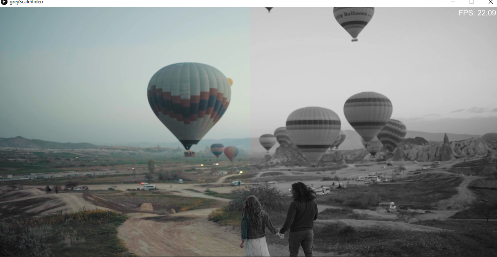

## Rendimiento computacional greyShades en video
Link al [código fuente](https://github.com/VisualUN/Processing/tree/master/greyShadesVideo)

```
PImage img;
import processing.video.*;
Movie myMovie;
PFont font, f;
int resolution = 5;

void setup() {
  size(1200, 600);
  //img = loadImage("imagen.jpg");
  //image(img, width/2, 0, width/2, height);
  background(0);
  font = createFont("Courier", resolution + 3);
  f = createFont("Arial",16,true);
  myMovie = new Movie(this, "video.mp4");
  myMovie.loop();
  myMovie.volume(0);

}

void movieEvent(Movie m) {
  m.read();
}

void draw() {
  //las 2 al tiempo
  image(myMovie, width/2, 0, width/2, height);
  image(myMovie, 0, 0, width/2, height);
  for (int x=width/2; x<width; x++)
  {
    for (int y=0; y<height; y++)
    {
      color c = get(x, y);
      float red = red(c);
      float green = green(c);
      float blue = blue(c);
      int shadesNumber = 3; //NumberOfShades is a value between 2 and 256
      float conversionFactor = 255 / (shadesNumber -1);
      float average = (red+green+blue) /3;
      float grey = int(average/conversionFactor) * conversionFactor;
      color Color = color(grey, grey, grey);
      set(x, y, Color);
    }
  }
  textFont(f,18);
  fill(255);
  text("FPS: " + nf(frameRate, 0, 2), 1100, 20);
}
```
### Resultado:
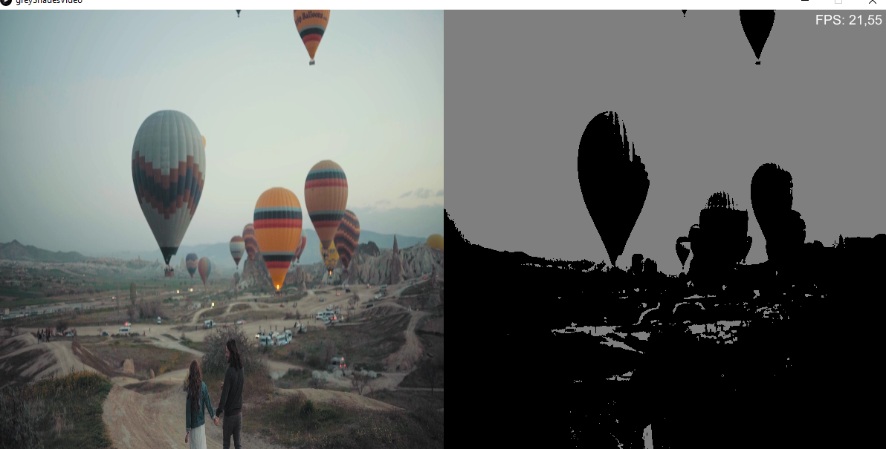

## Rendimiento computacional Luma en video
Link al [código fuente](https://github.com/VisualUN/Processing/tree/master/lumaVideo)

```
PImage img;
import processing.video.*;
Movie myMovie;

PFont font, f;
int resolution = 5;
void setup() {
  size(1200, 600);
  //img = loadImage("imagen.jpg");
  //image(img, width/2, 0, width/2, height);
  background(0);
  font = createFont("Courier", resolution + 3);
  f = createFont("Arial",16,true);
  myMovie = new Movie(this, "video.mp4");
  myMovie.loop();
  myMovie.volume(0);

}

void movieEvent(Movie m) {
  m.read();
}

void draw() {
  //las 2 al tiempo
  image(myMovie, width/2, 0, width/2, height);
  image(myMovie, 0, 0, width/2, height);
  for (int x=width/2; x<width; x++)
  {
    for (int y=0; y<height; y++)
    {
      color c = get(x, y);
      float red = red(c);
      float green = green(c);
      float blue = blue(c);
      float grey = red*0.299 + green*0.587 + blue*0.114;
      color Color = color(grey, grey, grey);
      set(x, y, Color);
    }
  }
  textFont(f,18);
  fill(255);
  text("FPS: " + nf(frameRate, 0, 2), 1100, 20);
}
```
### Resultado:
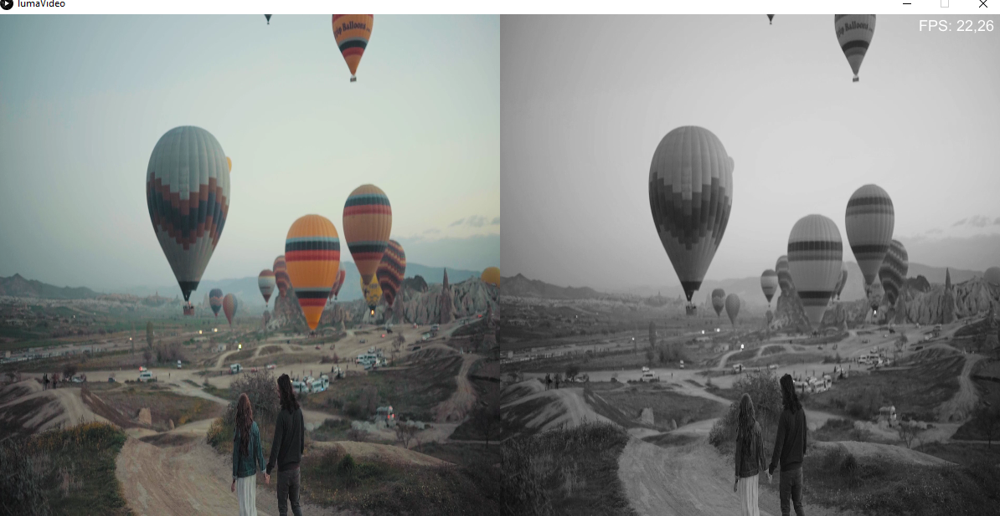

This is a link to [another document.](doc3.md)  
This is a link to an [external page.](http://www.example.com)
