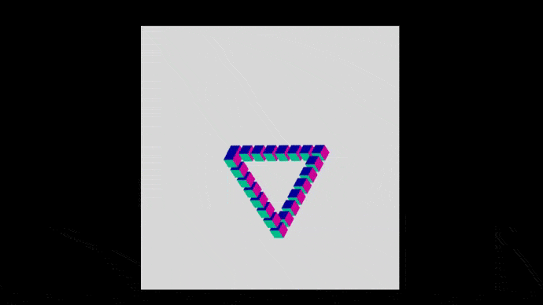
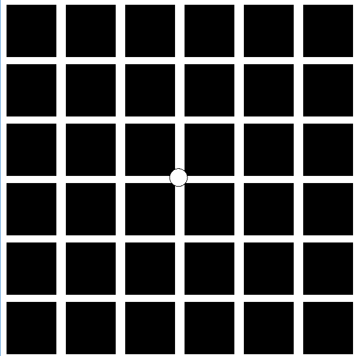
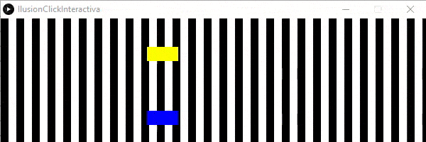

## Ilusión 1: Percepción de color

Link al [código fuente](https://github.com/VisualUN/Processing/tree/master/ilusionColor)
```
int Y_AXIS = 1;
int X_AXIS = 2;
// Define colors
color greyback = color(51,51,51);
color whiteback = color(255);
color grey = color(145,145,145);
boolean reveal = false;

void setup() {
  size(640, 360);
  // Background
  setGradient(0, 0, width, height, greyback, whiteback, X_AXIS);
  // Foreground
  setGradient(50, 190, 540, 80, grey, grey, X_AXIS);
  //noLoop();
}

void setGradient(int x, int y, float w, float h, color c1, color c2, int axis ) {

  noFill();

  if (axis == X_AXIS) {  // Left to right gradient
    for (int i = x; i <= x+w; i++) {
      float inter = map(i, x, x+w, 0, 1);
      color c = lerpColor(c1, c2, inter);
      stroke(c);
      line(i, y, i, y+h);
    }
  }
}

void mouseClicked() {
  if(reveal == false){
    //background
    setGradient(0, 0, width, height, whiteback, whiteback, X_AXIS);
    // Foreground
    setGradient(50, 190, 540, 80, grey, grey, X_AXIS);
    reveal = true;

  }
  else{
    //background
    setGradient(0, 0, width, height, greyback, whiteback, X_AXIS);
    // Foreground
    setGradient(50, 190, 540, 80, grey, grey, X_AXIS);
    reveal = false;
  }

}

```
## Ilusión
El usuario percibe que la barra tiene distintos tonos de gris cuando no es así. Esta ilusión se produce por el gradiente de color
que hay en el fondo. Este fenómeno tiene relación con el efecto Bezold, el cual sugiere que un color puede ser apreciado de manera diferente dependiendo de su relación con los colores adyacentes.

## Interactividad
El usuario puede hacer click, de manera que se elimina el gradiente del fondo quedando este completamente blanco. Esto
le permite al usuario apreciar que la franja gris no tiene variaciones, sino que es completamente del mismo color.

### Resultado:


### Interactividad al hacer click


### Referencias
- https://processing.org/examples/lineargradient.html
- https://twistedsifter.com/2017/12/horizontal-bar-is-single-shade-of-gray-bezold-effect/


## Ilusión 2: Triángulo de Penrose

Link al [código fuente](https://github.com/VisualUN/Processing/blob/master/penrose.js)
```
var anglex = 42
var angley = -36.65
var anglez = 0
function setup() {
  createCanvas(500, 400, WEBGL);
  angleMode(DEGREES);
  currCamera = createCamera();
  currCamera.ortho();
}

function mouseClicked() {

}

function draw() {

  orbitControl();
  background(215);
  normalMaterial();
  ambientLight("#FF7F15");
  specularMaterial(220);

  let locX = height / 2;
  let locY = width / 2;
  pointLight(220, 220, 220, locX, locY, 150);
  //emissiveMaterial("#FF7F15");
  normalMaterial();
  const numblocks = 7;

  //rotate(angle);
  rotateY(angley);
  rotateX(anglex);
  rotateZ(anglez);
  //angle++;
  //console.log(angle)
  rectMode(CENTER);

  for (let z = 0; z <= numblocks; z++) {
       translate(20, 0, 0);
       push();
       box(15, 15, 15);
       pop();

  }

  for (let y = 0; y < numblocks; y++) {
       translate(0, 20, 0);
       push();
       box(15, 15, 15);
       pop();

  }

  for (let x = 0; x < numblocks; x++) {
       translate(0, 0, 20);
       push();
       box(15, 15, 15);
       pop();

  }

}
```
## Ilusión
El usuario percibe que se forma un triángulo, sin embargo esta figura es un objeto que no puede ser construido en un espacio tridimensional. La ilusión consiste en
observar una disposición de una serie de cubos que desde el ángulo apropiado parecen formar un Triángulo de Penrose.

## Interactividad
El usuario puede girar la figura en 3D usando el mouse para darse cuenta que el Triángulo se forma gracias a un efecto de perspectiva
cuando el ángulo es el apropiado.

### Resultado:


### Referencias
- https://p5js.org/es/reference/
- https://www.yeggi.com/q/penrose/3/

## Ilusión 3: Cuadrícula de Hermann

Link al [código fuente](https://github.com/VisualUN/Processing/tree/master/gridIlusion)
### Código Processing
```
PShader grid;

void setup() {
  size(600, 600, P3D);
  grid = loadShader("grid.glsl");
  //grid.set("resolution", width, height);
}

void draw() {
   filter(grid);
   ellipseMode(RADIUS);  // Set ellipseMode to RADIUS
   fill(255);  // Set fill to white
   ellipse(width/2, height/2, 15 , 15);  // Draw white ellipse using RADIUS mode

}
```
### Fragment Shader
```
precision mediump float;

uniform float vpw = 600; // Width, in pixels
uniform float vph = 600; // Height, in pixels

uniform vec2 offset =  vec2(-1,1);
uniform vec2 pitch = vec2(100,100);

void main() {
  float lX = gl_FragCoord.x / vpw;
  float lY = gl_FragCoord.y / vph;

  float scaleFactor = 60000000.0;

  float offX = (scaleFactor * offset[0]) + gl_FragCoord.x;
  float offY = (scaleFactor * offset[1]) + (1.0 - gl_FragCoord.y);

  if (int(mod(offX, pitch[0])) < 12 || int(mod(offY, pitch[1])) < 12) {
    gl_FragColor = vec4(1.0, 1.0, 1.0, 1.5);
  } else {
    gl_FragColor = vec4(0, 0, 0, 1.0);
  }
}

```

## Ilusión
Cuando el usuario mira la cuadrícula blanca sobre el fondo negro, se tiene la impresión de que surgen manchas o circulos grises en las intersecciones de las líneas. Sin embargo, estos circulos desaparecen cuando se observa directamente la intersección. Esta ilusión fue observada por primera vez por Ludimar Hermann en 1870. Esta ilusión se desarrolló utilizando un fragment shader.

### Resultado:


### Referencias
- https://es.wikipedia.org/wiki/Ilusi%C3%B3n_de_la_cuadr%C3%ADcula
- https://stackoverflow.com/questions/24772598/drawing-a-grid-in-a-webgl-fragment-shader

## Ilusión 4: Moiré Patterns

Link al [código fuente](https://github.com/VisualUN/Processing/tree/master/moire)
### Código Processing
```
PImage img, grid;
/*
*this visual ilusion works with the concept of Moire patterns, this is based on
*interference between images where the ilusion of a moving image is done 
*thanks to a see-through grid and an image with patterns that align with the 
*empty spaces in the aforementioned grid
*
*To change to another image just change the name that is assigned
*to the variable "img", the following images are available: dinosaurio, minecraft, 
superman, ball, tunnel and technology
*if you wish to add your own images you must make sure that the size of the image
is the same as the grid, otherwise it wont work.
*
*original images by illusion channel brusspup
*https://www.youtube.com/watch?v=UW5bcsax78I
*/

void setup()
{
  size(700,600);    
  img = loadImage("dinosaurio.PNG"); 
  grid = loadImage("grilla.png");
}

void draw()
{
  imageMode(CENTER);
  background(255);
  image(img, 350, 300);
  image(grid, mouseX, 300);  
}
```

## Ilusión
Cuando el usuario mueve el mouse en el eje horizontal, va moviendo la grilla que esta encima de una imagen estatica, al hacer esto da la ilusion de movimiento, en este caso la de un dinosaurio caminando; esto se produce dado que los espacios vacios en la grilla se alinean con las lineas de la imagen estatica, las imagenes deben tener el mismo tamaño o el efecto no se podra ver.

### Resultado:


### Referencias
- https://en.wikipedia.org/wiki/Moir%C3%A9_pattern
- https://www.youtube.com/watch?v=UW5bcsax78I


## Ilusión: Interactividad con click

Link al [código fuente](https://github.com/VisualUN/Processing/tree/master/IlusionClickInteractiva)
```
int counter;
int canvasHeight = 174;
int canvasWidth = 484;
int stripWidth = 11;
int blockWidth = 44;
int blockHeight = 20;
int yYellow = 40;
int yBlue = 130;

void setup() {  //setup function called initially, only once
  size(600, 174);
  counter = 0;
}

void draw() {  //draw function loops 
  background(255);  //set background white
  if(mousePressed == false) { // make black stripes
    fill(0);
    for (int i=0; i<600; i = i+2*stripWidth) {
      rect(i, 0, stripWidth, canvasHeight);
    }
  }
  counter++;
  noStroke();
  // draw yellow rectangle
  fill(255,255,0);
  rect(counter, yYellow, blockWidth, blockHeight);
  // draw yellow rectangle
  fill(0,0,255);
  rect(counter, yBlue, blockWidth, blockHeight);
  // after leaving the canvas restart at left
  if (counter == canvasWidth) {
    counter = 0;
  }
}
```
## Ilusión
El usuario percibe dos objetos que avanzan a la par, sin embargo con cada linea negra se observa una especie de "frenado", al hacer click las lineas desaparecen y los dos objetos avanzan constantemente.

## Interactividad
El usuario puede hacer click para desaparecer las lineas negras verticales y asi conseguir un movimiento constante en los dos objetos.

### Resultado:


### Referencias
- https://www.openprocessing.org/sketch/157238/
- https://processing.org/reference/mousePressed_.html

## Ilusión: secuencias

Link al [código fuente](https://github.com/VisualUN/Processing/tree/master/Optical_Illusion)
```
float angle;

void setup(){
  size(963,850);
  surface.setLocation(957, 0);
  noStroke();
  fill(0, 15, 30);
}

void draw(){
  background(255);
  
  float x = width;
  float dia = 110;
  int num = 100;
  
  translate(width/2, height/2);
  for(float a=0; a<360; a+=22.5){
    rotate(radians(a));
    pushMatrix();
    for(int i=0; i<num; i++){
      scale(0.95);
      rotate(radians(angle));
      ellipse(x, 0, dia, dia);
    }
    popMatrix();
    pushMatrix();
    for(int i=0; i<num; i++){
      scale(0.95);
      rotate(-radians(angle));
      ellipse(x, 0, dia, dia);
    }
    popMatrix();
  }
  angle+=0.01;
}
```
## Ilusión
El usuario percibe diferentes secuencias de ilusiones opticas que cambian con el transcurso del tiempo.

## Interactividad
La interabilidad de esta secuencia esta dada por el transucrso del tiempo.

### Resultado:


### Referencias
- http://bibliotecadigital.econ.uba.ar/download/cuadcimbage/cuadcimbage_n18_04.pdf

## Ilusión: Waves

Link al [código fuente](https://github.com/VisualUN/Processing/tree/master/waves)
```
int xspacing = 16; 
int w;

float theta = 0.0;
float amplitude = 75.0;
float period = 500.0;
float dx;
float[] yvalues;

void setup() {
  size(640, 360);
  w = width+16;
  dx = (TWO_PI / period) * xspacing;
  yvalues = new float[w/xspacing];
}

void draw() {
  background(0);
  calcWave();
  renderWave();
}

void calcWave() {
  theta += 0.02;

  float x = theta;
  for (int i = 0; i < yvalues.length; i++) {
    yvalues[i] = sin(x*2)*amplitude;
    x+=dx;
  }
}

void renderWave() {
  noStroke();
  fill(255);
  for (int x = 0; x < yvalues.length; x++) {
    ellipse(x*xspacing, height/2+yvalues[x], 16+(abs(yvalues[x]))/50, 16);
  }
}
```
## Ilusión
El usuario percibe diferentes secuencias de ilusiones opticas que cambian con el transcurso del tiempo.

### Resultado:


### Referencias
- https://processing.org/examples/sinewave.html


### Discusión
## 1 Complete la tabla
| Ilusión     | Categoria   | Referencia     | Tipo de interactividad (si aplica)   | URL código base |
| ----------- | ----------- | -----------    | ------------------------------------ | ----------------------------                   |
| Gradiente gris | Percepción de color | https://twistedsifter.com/2017/12/horizontal-bar-is-single-shade-of-gray-bezold-effect| Click del mouse | https://processing.org/examples/lineargradient.html
| Triángulo de Penrose | Perspectiva geométrica| L. S. Penrose, R. Penrose (1958). "OBJETOS IMPOSIBLES: UN TIPO ESPECIAL DE ILUSIÓN VISUAL". El British Journal of Psychology. 49 (1): 31–33. doi:10.1111/j.2044-8295.1958.tb00634.x. | Girar la figura en 3D | n/a
| Cuadrícula de Hermann   | Simultaneous Lightness Contrast (SLC) | Qian, K., Kawabe, T., Yamada, Y. et al. The role of orientation processing in the scintillating grid illusion. Atten Percept Psychophys 74, 1020–1032 (2012). https://doi.org/10.3758/s13414-012-0295-y | n/a | https://stackoverflow.com/questions/24772598/drawing-a-grid-in-a-webgl-fragment-shader |
| Moiré pattern | Ilusion de movimiento | TRossler, T., Hrabovsky, M. & Pochmon, M. Moire methods for measurement of displacement and topography. Czech J Phys 56, 101–124 (2006). https://doi.org/10.1007/s10582-006-0073-y | Movimiento del mouse | https://processing.org/reference/imageMode_.html |
| Interactividad con click   | Percepción de color        | https://es.wikipedia.org/wiki/Percepci%C3%B3n_del_color | Click del mouse | https://processing.org/examples/tickle.html |
| Secuencias   | Percepción de profundidad y movimiento        |L.Lazzari, P.Moulia & A.Gervasoni, APORTES DE LAS ILUSIONES ÓPTICAS A DIFERENTES
CAMPOS DEL CONOCIMIENTO. Cuadernos del CIMBAGE Nº 18 (2016) 81-107 (2016). https://doi.org/10.1007/s10582-006-0073-y | n/a | https://processing.org/examples/sequential.html |
| Waves   | Movimiento | https://processing.org/examples/sinewave.html | n/a | https://processing.org/examples/sinewave.html |


## 2 Describa brevememente las referencias estudiadas y los posibles temas en los que le gustaría profundizar
Para la categoría de percepcion de color se escogio el gradiente gris basado en el efecto bezold, este efecto se basa en el principio de efecto de propagación en el cual se muestra que un color puede parecer diferente dependiendo de su relacion con los colores adyacentes, este efecto sucede cuando se intercalan pequeñas areas de color. Se utilizó esta referencia ya que explica de manera clara y con ejemplos el funcionamiento de este tipo de ilusión.

En perspectiva geométrica tenemos el Triángulo de Penrose, un ejemplo clasico de ilusion visual, puesto que este triángulo es un objeto imposible ya que debido a sus propiedades no satisface ningúna figura tradicional en un espacio euclidiano ordinario. Se utilizo este libro como referencia debido a que es el articulo mismo publicado por Penrose.

En contraste de luz simultanea tenemos la Cuadricula de Hemann se utilizo esta referencia puesto que este paper examina a profundidad la ilusion de reja brillante de Hemann, mediante diversos experimentos basados en la modificación de factores como la longitud de las barras, el desplazamiento lateral de las barras y el tamaño de los espacios espaciales entre las barras separadas; este paper logra darle un transfondo más amplio del credo común de que la ilusión depende de la orientación de las barras, sino que surge de las diferencias en la magnitud de la actividad de las celdas de las intersecciones y las que estan a lo largo de las barras.

En ilusion de movimiento utilizamos el patron de moire, utilizamos esta referencia debido a que da una vista mucho mas exacta y amplia de las propiedades de este patron conocido, así como los principios de su origen, todo esto aplicados para comprender mucho mas del ejercicio en processing.


En ilusion de secuencias se puso como referencia este cuaderno puesto que da un panorama muy amplio y acertado de las diferentes ilusiones opticas que existen, ya sean fisiólogicas, cognitivas 


