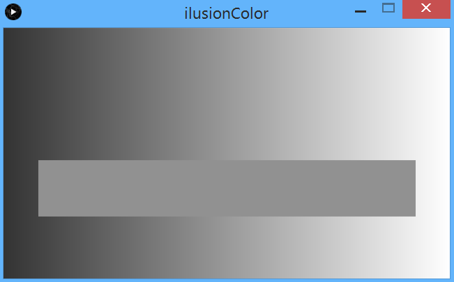
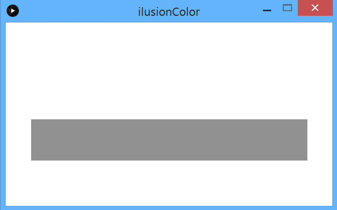

## Ilusión 1: Percepción de color

Link al [código fuente](https://github.com/VisualUN/Processing/tree/master/ilusionColor)
```
int Y_AXIS = 1;
int X_AXIS = 2;
// Define colors
color greyback = color(51,51,51);
color whiteback = color(255);
color grey = color(145,145,145);
boolean reveal = false;

void setup() {
  size(640, 360);
  // Background
  setGradient(0, 0, width, height, greyback, whiteback, X_AXIS);
  // Foreground
  setGradient(50, 190, 540, 80, grey, grey, X_AXIS);
  //noLoop();
}

void setGradient(int x, int y, float w, float h, color c1, color c2, int axis ) {

  noFill();

  if (axis == X_AXIS) {  // Left to right gradient
    for (int i = x; i <= x+w; i++) {
      float inter = map(i, x, x+w, 0, 1);
      color c = lerpColor(c1, c2, inter);
      stroke(c);
      line(i, y, i, y+h);
    }
  }
}

void mouseClicked() {
  if(reveal == false){
    //background
    setGradient(0, 0, width, height, whiteback, whiteback, X_AXIS);
    // Foreground
    setGradient(50, 190, 540, 80, grey, grey, X_AXIS);
    reveal = true;

  }
  else{
    //background
    setGradient(0, 0, width, height, greyback, whiteback, X_AXIS);
    // Foreground
    setGradient(50, 190, 540, 80, grey, grey, X_AXIS);
    reveal = false;
  }

}

void draw() {

}
```
## Interactividad
El usuario puede hacer click, de manera que se elimina el gradiente del fondo quedando este completamente blanco. Esto
le permite al usuario apreciar que la franja gris no tiene variaciones, sino que es completamente del mismo color.

### Resultado:


### Interactividad al hacer click



### Referencias
https://processing.org/examples/lineargradient.html
