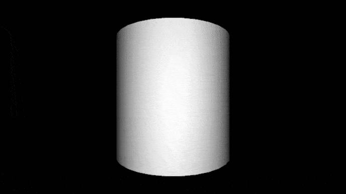
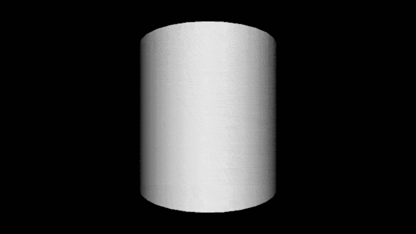
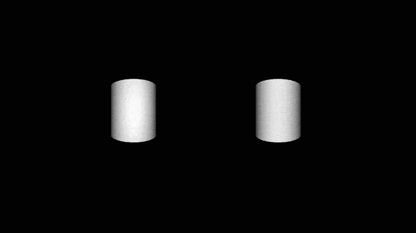

## Ambient Light
Se agrega luz ambiente roja, la cual viene de todas las direcciones por lo que para poder ver la forma 3D de las figuras que están rotando respecto al centro de la ventana se agrega una luz direccional del mismo color.

Processing 
```
int counterForRotation=0;
boolean isRotating = true;
void setup(){
  size(800,800,P3D);
  smooth(8);
}
void draw(){
  
  if (isRotating) {
    counterForRotation++;
  }//if 
  
  background(0);
  
 
  noStroke();
  pushMatrix();
  rotateX(PI * 0.20);
  translate(width/2, height/2);
  directionalLight(128, 0, 0, 1000, 50, -300);
  ambientLight(128,0,0,500, 500,500);
  rotateZ(counterForRotation * 0.001 * TWO_PI);
    ambient(255,255,0);
    beginShape(TRIANGLES);
    fill(255);
    vertex(-300, -100, -100);
    vertex(-100, -100, -100);
    vertex(-200,    0,  100);

    vertex(-100, -100, -100);
    vertex(-100,  100, -100);
    vertex(-200,    0,  100);

    vertex(-100, 100, -100);
    vertex(-300, 100, -100);
    vertex(-200,   0,  100);

    vertex(-300,  100, -100);
    vertex(-300, -100, -100);
    vertex(-200,    0,  100);
endShape();
    translate(100, 0);
    sphere(100);
  popMatrix();
}

void mousePressed() {
  isRotating = !isRotating;
}
```


Link al [código fuente](https://github.com/VisualUN/Processing/tree/master/ambient_light)

## Light attenuation
Se usa un punto de luz verde y la función **lightFalloff** la cual usa la formula `falloff = 1/(constante + d*lineal + (d*d)*cuadratica)` donde d es la distancia entre el punto de luz y el vector que se esté analizando y con esto obtener el porcentaje de luz que tendrá dicho vector. Con esto se podrá obtener un efecto de atenuación de la luz a medida que el vector se aleje mas del punto de luz.

Processing 
```
int counterForRotation=0;
boolean isRotating = true; 
void setup(){
  size(800,800,P3D);
  smooth(8);
}
void draw(){
  
  if (isRotating) {
    counterForRotation++;
  }//if 
  
  background(0);
  noStroke();
  pushMatrix();
  rotateX(PI * 0.20);
  translate(width/2, height/2);
  lightFalloff(1.0, 0.0015, 0.000002);
  pointLight(127, 255, 0, 0, 600, 700);
  rotateZ(counterForRotation * 0.0005 * TWO_PI);
 
    ambient(255,255,0);
    beginShape(TRIANGLES);
    fill(255);
    vertex(-300, -100, -100);
    vertex(-100, -100, -100);
    vertex(-200,    0,  100);

    vertex(-100, -100, -100);
    vertex(-100,  100, -100);
    vertex(-200,    0,  100);

    vertex(-100, 100, -100);
    vertex(-300, 100, -100);
    vertex(-200,   0,  100);

    vertex(-300,  100, -100);
    vertex(-300, -100, -100);
    vertex(-200,    0,  100);
endShape();
    translate(100, 0);
    box(200);
  popMatrix();
}

void mousePressed() {
  isRotating = !isRotating;
}
```


Link al [código fuente](https://github.com/VisualUN/Processing/tree/master/light_attenuation)


## Fog: Niebla mediante fragment shaders
Se agrega niebla a una escena de un cilindro que posee una textura. En el primer ejemplo se modifica en cada frame el valor de alpha,
que es el parámetro que se usa para interpolar en la función mix entre el valor de la textura y el color de la niebla. En el segundo
ejemplo el alpha se multiplica por la distancia entre la coordenada del vertex y la posición de la cámara.

Processing
```
PImage label;
PShape can;
float angle;
float alpha;
int alpha_zero_cnt;
boolean increase_alpha;
color fog_color;
PVector fog_colorv;

PShader fogShader;

void setup() {
  size(640, 360, P3D);
  fog_colorv = new PVector(167,48,246);
  PVector norm_fog_color = new PVector(fog_colorv.x/255,fog_colorv.y/255,fog_colorv.z/255);
  alpha = 1.0;
  alpha_zero_cnt = 0;
  increase_alpha = false;
  label = loadImage("leaf.jpg");
  can = createCan(100, 200, 32, label);
  fogShader = loadShader("fogfrag.glsl", "fogvert.glsl");
  fogShader.set("fog_color", norm_fog_color);
}

void draw() {    
  background(fog_colorv.x, fog_colorv.y, fog_colorv.z);
  fogShader.set("u_fogAmount", alpha);
  shader(fogShader);

  pointLight(255, 255, 255, width/2, height, 200);  

  translate(width/2, height/2);
  rotateY(angle);  
  shape(can);  
  angle += 0.01;
  if(alpha==1){
     increase_alpha = false;
  }
  if(alpha<=0){
     alpha_zero_cnt++;
  }

  if(alpha_zero_cnt == 15){
     alpha_zero_cnt = 0;
     increase_alpha = true;
  }

  if(increase_alpha == true){
     alpha = alpha + 0.005;
  }

  if(increase_alpha == false){
     alpha = alpha - 0.005;
  }


}

void onClicked(){

}

PShape createCan(float r, float h, int detail, PImage tex) {
  textureMode(NORMAL);
  PShape sh = createShape();
  sh.beginShape(QUAD_STRIP);
  sh.noStroke();
  sh.texture(tex);
  for (int i = 0; i <= detail; i++) {
    float angle = TWO_PI / detail;
    float x = sin(i * angle);
    float z = cos(i * angle);
    float u = float(i) / detail;
    sh.normal(x, 0, z);
    sh.vertex(x * r, -h/2, z * r, u, 0);
    sh.vertex(x * r, +h/2, z * r, u, 1);    
  }
  sh.endShape();
  return sh;
}
```

Fragment Shader
```
#ifdef GL_ES
precision mediump float;
precision mediump int;
#endif

uniform sampler2D texture;

varying vec4 vertColor;
varying vec4 vertTexCoord;
uniform float u_fogAmount;
uniform vec3 fog_color;

void main() {
  //gl_FragColor = texture2D(texture, vertTexCoord.st) * vertColor;
  gl_FragColor = mix(texture2D(texture, vertTexCoord.st) * vertColor, vec4(fog_color,1.0), u_fogAmount);
}

```


Link al [código fuente](https://github.com/VisualUN/Processing/tree/master/fog_cilinder)


Fragment Shader
```
#ifdef GL_ES
precision mediump float;
precision mediump int;
#endif

uniform sampler2D texture;

varying vec4 vertColor;
varying vec4 vertTexCoord;
uniform float u_fogAmount;
uniform vec3 fog_color;

void main() {
  //gl_FragColor = texture2D(texture, vertTexCoord.st) * vertColor;
  float d = distance(CameraEye, vertTexCoord);
  gl_FragColor = mix(texture2D(texture, vertTexCoord.st) * vertColor, vec4(fog_color,1.0), u_fogAmount*d);
}

```


El color de la niebla es un parámetro que se le envía al fragment shader y puede ser modificado.


Link al [código fuente](https://github.com/VisualUN/Processing/tree/master/fog_w)

## Combine all the simple lighting models (ambient, diffuse and specular) using per-vertex and per-pixel shaders
Se agrego iluminacion combinando ambient, diffuse y specular. Para el primer ejemplo se usa per-pixel en una can basada en un ejemplo de clase,
para el segundo ejemplo se hace algo parecido con la misma can pero en este caso se hace uso de per-vertex. En la ultima parte se hace una comparacion de amabas 
iluminaciones.

Per-Pixel
```
PShape can;
float angle;

PShader pixlightShader;

void setup() {
  size(640, 360, P3D);
  can = createCan(100, 200, 32);
  pixlightShader = loadShader("pixlightfrag.glsl", "pixlightvert.glsl");
}

void draw() {    
  background(0);
  

  
  //pointLight(255, 200, 10, width/2, height, 200);
 
  //pointLight(51, 102, 126, 35, 40, 36);
  pointLight(51, 102, 126, 0, height/2, 36);
  pointLight(51, 102, 126, width, height/2, 36);
  //pointLight(51, 102, 126, width, height/2, 36);
  shader(pixlightShader);
  
  translate(width/2, height/2);
  rotateY(angle);  
  shape(can);  
  angle += 0.01;
}

PShape createCan(float r, float h, int detail) {
  textureMode(NORMAL);
  PShape sh = createShape();
  sh.beginShape(QUAD_STRIP);
  sh.noStroke();
  for (int i = 0; i <= detail; i++) {
    float angle = TWO_PI / detail;
    float x = sin(i * angle);
    float z = cos(i * angle);
    float u = float(i) / detail;
    sh.normal(x, 0, z);
    sh.vertex(x * r, -h/2, z * r, u, 0);
    sh.vertex(x * r, +h/2, z * r, u, 1);    
  }
  sh.endShape(); 
  return sh;
}
```



Per-Vertex

```
PShape can;
float angle;

PShader lightShader;

void setup() {
  size(640, 360, P3D);
  can = createCan(100, 200, 32);
  lightShader = loadShader("lightfrag.glsl", "lightvert.glsl");
}

void draw() {    
  background(0);
  

  
  //pointLight(255, 200, 10, width/2, height, 200);
 
  //pointLight(51, 102, 126, 35, 40, 36);
  pointLight(51, 102, 126, 0, height/2, 36);
  pointLight(51, 102, 126, width, height/2, 36);
  //pointLight(51, 102, 126, width, height/2, 36);
  shader(lightShader);
  
  translate(width/2, height/2);
  rotateY(angle);  
  shape(can);  
  angle += 0.01;
}

PShape createCan(float r, float h, int detail) {
  textureMode(NORMAL);
  PShape sh = createShape();
  sh.beginShape(QUAD_STRIP);
  sh.noStroke();
  for (int i = 0; i <= detail; i++) {
    float angle = TWO_PI / detail;
    float x = sin(i * angle);
    float z = cos(i * angle);
    float u = float(i) / detail;
    sh.normal(x, 0, z);
    sh.vertex(x * r, -h/2, z * r, u, 0);
    sh.vertex(x * r, +h/2, z * r, u, 1);    
  }
  sh.endShape(); 
  return sh;
}
```



COMPARACION



Link al [código fuente](https://github.com/jsensunchop/Ilumination)


## Use up to 8 lights in the model, relating each light source with a nub node
Se agrego iluminacion utilizando 3 lamparas


```
/**
 * Inspired by the Luxo example by Jean Pierre Charalambos.
 *
 * There are three small lamps which are connected by nodes
 * they have a parent reationship so if we move the father it will move their respective sons
 *  * 
 */

import nub.primitives.*;
import nub.core.*;
import nub.core.constraint.*;
import nub.processing.*;

Scene scene;
Lamp lamp;

void setup() {
  size(1000, 700, P3D);
  scene = new Scene(this);
  scene.fit(1);
  lamp = new Lamp();
}

void draw() {
  background(0);
  lights();

  //draw the lamp
  scene.render();

  //draw the ground
  noStroke();
  fill(120, 120, 120);
  float nbPatches = 100;
  normal(0, 0, 1);
  for (int j = 0; j < nbPatches; ++j) {
    beginShape(QUAD_STRIP);
    for (int i = 0; i <= nbPatches; ++i) {
      vertex((200 * (float) i / nbPatches - 100), (200 * j / nbPatches - 100));
      vertex((200 * (float) i / nbPatches - 100), (200 * (float) (j + 1) / nbPatches - 100));
    }
    endShape();
  }
  
}

void mouseMoved() {
  scene.mouseTag();
}

void mouseDragged() {
  // no inertia for the nodes, but for the eye
  if (mouseButton == LEFT) {
    if (!scene.mouseSpinTag(0))
      scene.mouseSpinEye(0.85);
  } else if (mouseButton == RIGHT) {
    if (!scene.mouseTranslateTag(0))
      scene.mouseTranslateEye(0.85);
  } else {
    if (!scene.scaleTag(mouseX - pmouseX, 0))
      scene.scaleEye(mouseX - pmouseX, 0.85);
  }
}

void mouseWheel(MouseEvent event) {
  scene.moveForward(event.getCount() * 20);
}

/**
 * Lamp class inspired by the Lamp class of the Luxo example by Jean Pierre Charalambos.
 *
 * Add a graphics handler to an InteractiveNode to automatically pick
 * an object. The object is described in the graphics handler procedure.
 */

class Lamp {
  Piece[] pieces;

  Lamp() {
    pieces = new Piece[12];

    for (int i = 0; i < 4; ++i) {
      pieces[i] = new Piece();
      node(i).setReference(i > 0 ? pieces[i - 1] : null);
    }
    
    for (int i = 4; i < 8; ++i) {
      pieces[i] = new Piece();
      node(i).setReference(i > 0 ? pieces[i - 1] : null);
    }
    
    for (int i = 8; i < 12; ++i) {
      pieces[i] = new Piece();
      node(i).setReference(i > 0 ? pieces[i - 1] : null);
    }

    // Initialize nodes
    node(1).setTranslation(0, 0, 8); // Base height
    node(2).setTranslation(0, 0, 50);  // Arm length
    node(3).setTranslation(0, 0, 50);  // Arm length
    
    node(4).setTranslation(0, 0, 8); // Base height
    node(5).setTranslation(0, 0, 50);  // Arm length
    node(6).setTranslation(0, 0, 50);  // Arm length
    
    node(7).setTranslation(0, 0, 8); // Base height
    node(8).setTranslation(0, 0, 50);  // Arm length
    node(9).setTranslation(0, 0, 50);  // Arm length
    

    node(1).setRotation(Quaternion.from(Vector.plusI, 0.6));
    node(2).setRotation(Quaternion.from(Vector.plusI, -2));
    node(3).setRotation(Quaternion.from(new Vector(1, -0.3, 0), -1.7));
    
    node(5).setRotation(Quaternion.from(Vector.plusI, -2));
    node(6).setRotation(Quaternion.from(new Vector(1, -0.3, 0), -1.7));
    node(7).setRotation(Quaternion.from(Vector.plusI, 0.6));
    
    node(9).setRotation(Quaternion.from(Vector.plusI, -2));
    node(10).setRotation(Quaternion.from(new Vector(1, -0.3, 0), -1.7));
    node(11).setRotation(Quaternion.from(Vector.plusI, 0.6));
    

    // Set node graphics modes
    node(3).mode = 3;
    node(7).mode = 3;
    node(11).mode = 3;

    // Set node constraints
    WorldConstraint baseConstraint = new WorldConstraint();
    baseConstraint.setTranslationConstraint(AxisPlaneConstraint.Type.PLANE, Vector.plusK);
    baseConstraint.setRotationConstraint(AxisPlaneConstraint.Type.AXIS, Vector.plusK);
    node(0).setConstraint(baseConstraint);
    node(4).setConstraint(baseConstraint);
    node(8).setConstraint(baseConstraint);

    LocalConstraint XAxis = new LocalConstraint();
    XAxis.setTranslationConstraint(AxisPlaneConstraint.Type.FORBIDDEN, Vector.zero);
    XAxis.setRotationConstraint(AxisPlaneConstraint.Type.AXIS, Vector.plusI);
    node(1).setConstraint(XAxis);
    node(2).setConstraint(XAxis);
    node(5).setConstraint(XAxis);
    node(6).setConstraint(XAxis);
    node(9).setConstraint(XAxis);
    node(10).setConstraint(XAxis);

    LocalConstraint headConstraint = new LocalConstraint();
    headConstraint.setTranslationConstraint(AxisPlaneConstraint.Type.FORBIDDEN, Vector.zero);
    
  }

  Piece node(int i) {
    return pieces[i];
  }
}

class Piece extends Node {
  int mode;

  void drawCone(PGraphics pg, float zMin, float zMax, float r1, float r2, int nbSub) {
    pg.translate(0, 0, zMin);
    Scene.drawCone(pg, nbSub, 0, 0, r1, r2, zMax - zMin);
    pg.translate(0, 0, -zMin);
  }

  @Override
  public void graphics(PGraphics pGraphics) {
    switch (mode) {
    case 1:
      pGraphics.fill(isTagged(scene) ? 255 : 255, 0, 255);
      drawCone(pGraphics, 0, 3, 15, 15, 30);
      drawCone(pGraphics, 3, 5, 15, 13, 30);
      drawCone(pGraphics, 5, 7, 13, 1, 30);
      drawCone(pGraphics, 7, 9, 1, 1, 10);
      break;
    case 2:
      pGraphics.pushMatrix();
      pGraphics.rotate(HALF_PI, 0, 1, 0);
      drawCone(pGraphics, -5, 5, 2, 2, 20);
      pGraphics.popMatrix();

      pGraphics.translate(2, 0, 0);
      drawCone(pGraphics, 0, 50, 1, 1, 10);
      pGraphics.translate(-4, 0, 0);
      drawCone(pGraphics, 0, 50, 1, 1, 10);
      pGraphics.translate(2, 0, 0);
      break;
    case 3:
      pGraphics.fill(220, 20, isTagged(scene) ? 180 : 60);
      drawCone(pGraphics, 10, 10, 4, 4, 30);
      drawCone(pGraphics, 6, 15, 4, 8, 30);
      drawCone(pGraphics, 6, 17, 4, 8, 30);
      pGraphics.spotLight(155, 255, 255, 0, 0, 0, 0, 0, 1, THIRD_PI, 1);
      break;
    }
  }
}

```


Link al [código fuente](https://github.com/VisualUN/Processing/tree/master/Lights_nub)

### Referencias
- https://webglfundamentals.org/webgl/lessons/webgl-fog.html
- https://vicrucann.github.io/tutorials/osg-shader-fog/
- https://visualcomputing.github.io/nub-javadocs/nub/core/Node.html

